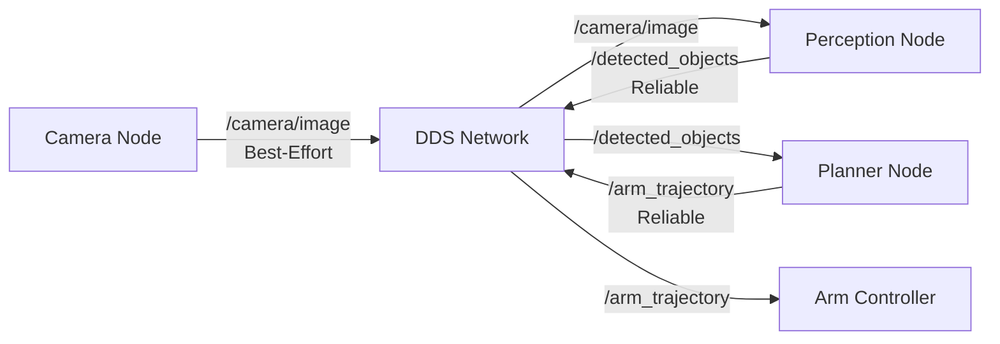

# Chapter 1: ROS 2 Middleware Fundamentals

## Learning Objectives

By the end of this chapter, you will be able to:

1. **Define** what middleware is and explain why robotics systems need it
2. **Explain** the key differences between ROS 1 and ROS 2 architecture
3. **Identify** the components of DDS (Data Distribution Service)
4. **Describe** how ROS 2 enables distributed robot systems

## What is Middleware?

**Middleware** is software that sits between the operating system and applications, providing communication and coordination services. Think of it as a "digital post office" that routes messages between different parts of a robot system.

### Why Robots Need Middleware

A humanoid robot has dozens of components that must work together:

- **Sensors**: Cameras, LiDAR, IMUs, force sensors
- **Processors**: Multiple computers (head, torso, limbs)
- **Actuators**: Motors controlling joints
- **AI Systems**: Perception, planning, decision-making

Without middleware, each component would need custom code to communicate with every other component. For a robot with 50 components, that's 1,225 possible connections to manage manually!

**Middleware solves this** by providing a standard communication layer where:
- Components publish data to named channels (**topics**)
- Other components subscribe to topics they need
- No component needs to know who else is listening

### Real-World Analogy

Imagine a humanoid robot kitchen assistant:

**Without Middleware**:
```
Camera → (custom code) → Perception AI
Camera → (different custom code) → Recording System
Perception AI → (custom code) → Arm Controller
Arm Controller → (custom code) → Gripper Motor
... 1000s of custom connections
```

**With Middleware**:
```
Camera → publishes to /camera/image topic
Perception AI → subscribes to /camera/image
Arm Controller → subscribes to /grasp_commands
Gripper Motor → subscribes to /gripper/position
```

Each component only knows about topics, not other components. This is called **decoupling**.

## ROS 1 vs ROS 2: Why the Upgrade?

### ROS 1 Architecture (Legacy)

ROS 1 used a **centralized master** node:

```
        ┌──────────────┐
        │  ROS Master  │ (Single point of failure)
        └──────┬───────┘
               │
      ┌────────┼────────┐
      ↓        ↓        ↓
   Node A   Node B   Node C
```

**Problems**:
- ❌ **Single point of failure**: If the master crashes, the entire robot stops
- ❌ **No real-time guarantees**: Unpredictable message delivery times
- ❌ **Poor security**: No encryption or authentication
- ❌ **Limited scalability**: Struggles with multi-robot systems

### ROS 2 Architecture (Modern)

ROS 2 uses **decentralized DDS** (Data Distribution Service):

```
   Node A ←→ DDS ←→ Node B
      ↑              ↓
      └─── DDS ──→ Node C

   (No master - nodes discover each other)
```

**Advantages**:
- ✅ **No single point of failure**: Nodes discover each other directly
- ✅ **Real-time capable**: Deterministic communication with QoS controls
- ✅ **Secure**: Built-in DDS security (encryption, authentication)
- ✅ **Scalable**: Supports multi-robot fleets and cloud robotics

## DDS: The Middleware Behind ROS 2

**DDS (Data Distribution Service)** is an industry-standard middleware for real-time systems. It's used in:
- Military aircraft and ships
- Medical devices
- Financial trading systems
- **Robotics** (via ROS 2)

### Key DDS Concepts

**1. Discovery**
- Nodes automatically find each other on the network
- No manual configuration needed
- Uses multicast or discovery servers

**2. Topics**
- Named channels for data streams
- Multiple publishers and subscribers per topic
- Example: `/camera/image`, `/joint_states`, `/cmd_vel`

**3. QoS (Quality of Service)**
- Policies controlling message reliability and delivery
- Customize for different use cases:
  - **Sensors** (high frequency): Best-effort, volatile (fast, OK to drop)
  - **Commands** (critical): Reliable, transient-local (guaranteed delivery)

**4. Data Types**
- Strongly typed messages (defined in `.msg` files)
- Common types: `std_msgs`, `sensor_msgs`, `geometry_msgs`
- Custom types for robot-specific data

### DDS in Action: Humanoid Arm Control



Each node connects to the DDS network. Messages flow based on topic subscriptions. If Perception Node crashes, Camera and Arm Controller continue operating.

## ROS 2 Distributions

ROS 2 releases follow a **turtle-themed** naming convention with annual releases:

| Distribution | Release Date | Support Level | Status |
|--------------|--------------|---------------|--------|
| Foxy Fitzroy | June 2020 | EOL (End of Life) | ❌ Ended May 2023 |
| Galactic Geochelone | May 2021 | EOL | ❌ Ended Dec 2022 |
| Humble Hawksbill | May 2022 | **LTS** | ✅ Supported until 2027 |
| Iron Irwini | May 2023 | Standard | ⚠️ Ends Nov 2024 |
| Jazzy Jalisco | May 2024 | Standard | ✅ Current |

**This textbook uses ROS 2 Humble** because:
- ✅ Long-Term Support (5 years)
- ✅ Stable APIs
- ✅ Widest hardware support
- ✅ Most third-party packages available

## The ROS 2 Ecosystem

Beyond middleware, ROS 2 provides:

**Tools**:
- `ros2 node` - List and inspect nodes
- `ros2 topic` - Monitor topics and messages
- `ros2 service` - Call services
- `ros2 bag` - Record and play back data

**Libraries**:
- `rclpy` - Python client library (what we'll use)
- `rclcpp` - C++ client library
- `tf2` - Coordinate frame transformations
- `geometry_msgs` - 3D math message types

**Packages**:
- `nav2` - Navigation stack
- `moveit2` - Motion planning
- `ros2_control` - Real-time control interfaces
- `gazebo_ros_pkgs` - Gazebo simulation integration

## Your First ROS 2 Command

Let's verify your ROS 2 installation and explore the system:

```bash
# Check ROS 2 version
ros2 --version

# List available commands
ros2 --help

# Run a demo talker node (publishes "Hello World" messages)
ros2 run demo_nodes_py talker
```

**Expected Output**:
```
[INFO] [talker]: Publishing: "Hello World: 0"
[INFO] [talker]: Publishing: "Hello World: 1"
[INFO] [talker]: Publishing: "Hello World: 2"
```

In another terminal:

```bash
# Listen to the messages
ros2 run demo_nodes_py listener
```

**Expected Output**:
```
[INFO] [listener]: I heard: [Hello World: 0]
[INFO] [listener]: I heard: [Hello World: 1]
```

**What just happened?**
- `talker` node published messages to the `/chatter` topic
- `listener` node subscribed to `/chatter` and received the messages
- DDS handled discovery and message routing automatically
- No master node required!

## ROS 2 in Humanoid Robotics

Modern humanoid robots rely heavily on ROS 2:

**Boston Dynamics Atlas**:
- Uses ROS-compatible middleware for perception and planning
- Hundreds of nodes coordinate sensors, motors, and AI systems

**Agility Robotics Digit**:
- ROS 2-based navigation and manipulation
- Nav2 for autonomous warehouse navigation

**Your Future Robot**:
- Will use the same ROS 2 patterns you learn in this module
- Scalable from simple joints to full humanoid systems

## Comprehension Questions

Test your understanding:

**Question 1**: What is the main advantage of middleware in robot systems?

<details>
<summary>Click to reveal answer</summary>

**Answer**: Middleware provides a standard communication layer that **decouples** components. Each component only needs to know about topics/services, not about other components. This enables modularity, reusability, and easier debugging. For example, you can replace a camera without modifying the perception code as long as both publish to the same topic.

</details>

---

**Question 2**: Why did ROS 2 replace the centralized master from ROS 1?

A) To make the system faster
B) To eliminate a single point of failure and enable real-time performance
C) To reduce the number of nodes needed
D) To simplify the programming model

<details>
<summary>Click to reveal answer</summary>

**Answer**: **B** - The centralized master was a single point of failure. If it crashed, the entire robot stopped working. ROS 2's decentralized DDS approach allows nodes to discover each other directly, and DDS provides QoS controls for real-time, deterministic communication required in safety-critical robots.

</details>

---

**Question 3**: What does DDS stand for, and what is its primary role in ROS 2?

<details>
<summary>Click to reveal answer</summary>

**Answer**: **DDS** stands for Data Distribution Service. Its primary role is to provide the underlying communication layer for ROS 2, handling message transport, node discovery, and quality-of-service policies. DDS is an industry-standard middleware used in many real-time systems beyond robotics.

</details>

---

**Question 4**: True or False: In ROS 2, a node must know the IP addresses of all other nodes it communicates with.

<details>
<summary>Click to reveal answer</summary>

**Answer**: **False**. DDS handles automatic discovery. Nodes find each other using multicast or discovery servers without manual configuration. This makes ROS 2 systems plug-and-play - add a new sensor node and it automatically appears on the network.

</details>

---

## Next Steps

Now that you understand ROS 2's architecture and purpose, you're ready to create your own ROS 2 nodes!

**Next Chapter**: [Nodes & Topics](./ch2-nodes-topics) - Learn to create publishers and subscribers →

---

**Chapter Summary**: ROS 2 is decentralized middleware built on DDS that provides scalable, real-time, secure communication for modern robots. Unlike ROS 1's centralized master, ROS 2 nodes discover each other automatically and communicate via topics, services, and actions. This architecture is essential for complex humanoid robots with dozens of sensors and actuators.
