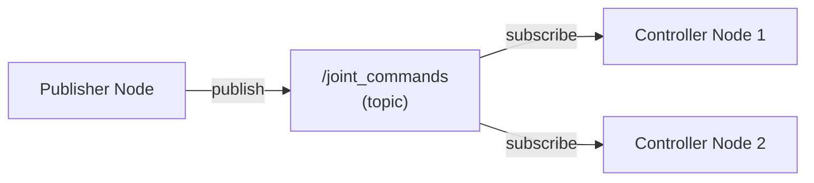

# Chapter 2: Nodes & Topics

## Learning Objectives

By the end of this chapter, you will be able to:

1. **Create** a ROS 2 node using Python (`rclpy`)
2. **Implement** publishers to send messages on topics
3. **Implement** subscribers to receive messages from topics
4. **Explain** when to use the publish-subscribe pattern
5. **Build** a simple humanoid joint controller using topics

## What is a ROS 2 Node?

A **node** is a process that performs a specific task in your robot system. Think of nodes as specialized workers:

- **Camera Node**: Captures images and publishes them
- **Perception Node**: Subscribes to images, detects objects
- **Planning Node**: Decides what actions to take
- **Controller Node**: Sends commands to motors

Each node is an independent program that can:
- Run on different computers
- Be written in different languages (Python, C++)
- Restart without affecting other nodes
- Be developed and tested separately

### The Single Responsibility Principle

**Good node design**: One node = one clear purpose

```
✅ GOOD:
- camera_node (captures images)
- object_detector (finds objects in images)
- arm_controller (moves arm to positions)

❌ BAD:
- everything_node (does camera + detection + control)
  # Hard to debug, test, and reuse
```

## Topics: The Publish-Subscribe Pattern

A **topic** is a named communication channel. Nodes don't communicate directly - they publish to and subscribe from topics.

### How Topics Work



**Key Properties**:
- **Many-to-many**: Multiple publishers, multiple subscribers
- **Asynchronous**: Publishers don't wait for subscribers
- **Unidirectional**: Data flows one way (publisher → subscriber)
- **Continuous streams**: Good for sensor data, state updates

## Creating Your First ROS 2 Node

Let's build a minimal node that prints "Hello from ROS 2!":

```python title="minimal_node.py" showLineNumbers
#!/usr/bin/env python3

# Import the ROS 2 Python library
import rclpy
from rclpy.node import Node  # Base class for all nodes

class MinimalNode(Node):
    """
    A minimal ROS 2 node that demonstrates basic node creation.

    This node does nothing except initialize and log a message.
    It's the simplest possible ROS 2 program.
    """
    def __init__(self):
        # Call the parent class constructor
        # The string 'minimal_node' is the node's name
        super().__init__('minimal_node')

        # Log an info message (appears in terminal)
        self.get_logger().info('Hello from ROS 2! Node is running.')

def main(args=None):
    # Initialize the ROS 2 Python client library
    rclpy.init(args=args)

    # Create an instance of our node
    node = MinimalNode()

    # Keep the node running (responding to callbacks)
    # Without this, the node would exit immediately
    rclpy.spin(node)

    # Clean shutdown when Ctrl+C is pressed
    rclpy.shutdown()

if __name__ == '__main__':
    main()
```

**Run it**:

```bash
# Make executable
chmod +x minimal_node.py

# Run the node
python3 minimal_node.py
```

**Expected Output**:
```
[INFO] [minimal_node]: Hello from ROS 2! Node is running.
```

**Explanation**:
- **Line 8**: Define a class inheriting from `Node`
- **Line 17**: Call `super().__init__()` with node name
- **Line 20**: Use `self.get_logger()` for logging (better than `print()`)
- **Line 29**: `rclpy.spin()` keeps the node alive
- **Ctrl+C**: Triggers shutdown and cleanup

## Creating a Publisher

Let's publish humanoid joint commands:

```python title="joint_publisher.py" showLineNumbers
import rclpy
from rclpy.node import Node
from std_msgs.msg import Float64  # Message type for joint positions

class JointPublisher(Node):
    """
    Publishes position commands to a humanoid shoulder joint.

    This demonstrates the publisher pattern: periodically sending
    data to a topic that other nodes can subscribe to.
    """
    def __init__(self):
        super().__init__('joint_publisher')

        # Create a publisher
        # Arguments: message_type, topic_name, queue_size
        self.publisher_ = self.create_publisher(
            Float64,                         # Message type
            '/humanoid/shoulder/command',    # Topic name
            10                               # Queue size (buffer 10 messages)
        )

        # Create a timer that calls publish_command every 0.5 seconds
        self.timer = self.create_timer(0.5, self.publish_command)

        # Track current joint position
        self.position = 0.0
        self.direction = 1  # 1 = increase, -1 = decrease

        self.get_logger().info('Joint publisher node started')

    def publish_command(self):
        """Called every 0.5 seconds by the timer."""
        # Create a message
        msg = Float64()
        msg.data = self.position

        # Publish it
        self.publisher_.publish(msg)

        # Log what we published
        self.get_logger().info(f'Publishing: {self.position:.2f} rad')

        # Update position for next time (move between -1.57 and +1.57 rad)
        self.position += 0.1 * self.direction

        if self.position >= 1.57:  # ~90 degrees
            self.direction = -1
        elif self.position <= -1.57:  # ~-90 degrees
            self.direction = 1

def main(args=None):
    rclpy.init(args=args)
    node = JointPublisher()
    rclpy.spin(node)
    rclpy.shutdown()

if __name__ == '__main__':
    main()
```

**Run it**:

```bash
python3 joint_publisher.py
```

**Expected Output**:
```
[INFO] [joint_publisher]: Joint publisher node started
[INFO] [joint_publisher]: Publishing: 0.00 rad
[INFO] [joint_publisher]: Publishing: 0.10 rad
[INFO] [joint_publisher]: Publishing: 0.20 rad
...
```

**Check topic**:

```bash
# In another terminal, verify the topic exists
ros2 topic list

# Should show: /humanoid/shoulder/command

# See the messages being published
ros2 topic echo /humanoid/shoulder/command
```

## Creating a Subscriber

Now let's create a node that receives these joint commands:

```python title="joint_subscriber.py" showLineNumbers
import rclpy
from rclpy.node import Node
from std_msgs.msg import Float64

class JointSubscriber(Node):
    """
    Subscribes to shoulder joint commands and logs received positions.

    In a real robot, this would send commands to the motor controller.
    For now, we just print the received values.
    """
    def __init__(self):
        super().__init__('joint_subscriber')

        # Create a subscription
        # Arguments: message_type, topic_name, callback_function, queue_size
        self.subscription = self.create_subscription(
            Float64,                         # Message type (must match publisher)
            '/humanoid/shoulder/command',    # Topic name (must match publisher)
            self.listener_callback,          # Function to call when message arrives
            10                               # Queue size
        )

        self.get_logger().info('Joint subscriber node started - listening for commands')

    def listener_callback(self, msg):
        """
        Called automatically whenever a message arrives on the topic.

        Args:
            msg: Float64 message containing joint position
        """
        position_rad = msg.data
        position_deg = position_rad * 57.3  # Convert radians to degrees

        self.get_logger().info(f'Received command: {position_rad:.2f} rad ({position_deg:.1f}°)')

        # In a real robot, you would send this command to the motor:
        # self.motor_controller.move_to(position_rad)

def main(args=None):
    rclpy.init(args=args)
    node = JointSubscriber()
    rclpy.spin(node)
    rclpy.shutdown()

if __name__ == '__main__':
    main()
```

**Test the System**:

```bash
# Terminal 1: Run publisher
python3 joint_publisher.py

# Terminal 2: Run subscriber
python3 joint_subscriber.py
```

**Subscriber Output**:
```
[INFO] [joint_subscriber]: Joint subscriber node started - listening for commands
[INFO] [joint_subscriber]: Received command: 0.00 rad (0.0°)
[INFO] [joint_subscriber]: Received command: 0.10 rad (5.7°)
[INFO] [joint_subscriber]: Received command: 0.20 rad (11.5°)
```

**Congratulations!** You've created a distributed robot system. The publisher and subscriber are separate programs communicating via ROS 2.

## Topic Introspection

ROS 2 provides powerful tools for inspecting running systems:

```bash
# List all active nodes
ros2 node list
# Output: /joint_publisher, /joint_subscriber

# List all topics
ros2 topic list
# Output: /humanoid/shoulder/command, /parameter_events, /rosout

# Get info about a topic
ros2 topic info /humanoid/shoulder/command
# Shows: publisher count, subscriber count, message type

# Check publishing rate
ros2 topic hz /humanoid/shoulder/command
# Shows: average rate: 2.0 messages/sec (we publish every 0.5 sec)

# View message structure
ros2 interface show std_msgs/msg/Float64
# Shows: float64 data
```

## Hands-On Exercises

Ready to practice? Complete these exercises:

1. **[Exercise 1: Create Your First ROS 2 Node](./exercises/ex1-first-node)** (30 min)
   - Build a node that prints your name every second

2. **[Exercise 2: Publisher-Subscriber System](./exercises/ex2-publisher-subscriber)** (1 hour)
   - Create a knee joint controller using pub/sub pattern

## Comprehension Questions

**Question 5**: In the publisher example, what would happen if we removed the `self.timer` line?

<details>
<summary>Click to reveal answer</summary>

**Answer**: Nothing would be published! The `create_timer()` call is what triggers `publish_command()` to run periodically. Without it, the node would initialize but never call the publishing function.

</details>

---

**Question 6**: Can multiple nodes subscribe to the same topic?

<details>
<summary>Click to reveal answer</summary>

**Answer**: **Yes!** Topics support multiple subscribers. For example, `/camera/image` might be subscribed to by: object detection, visual SLAM, video recording, and debugging visualizer - all simultaneously. Each subscriber receives a copy of every message.

</details>

---

## Next Steps

You've learned how to create nodes and use topics for robot communication. Next, you'll learn about **services** and **actions** for more complex interactions.

**Next Chapter**: [Services & Actions](./ch3-services-actions) →

---

**Chapter Summary**: ROS 2 nodes are independent processes that perform specific tasks. Topics enable publish-subscribe communication where nodes send and receive messages asynchronously. Publishers use `create_publisher()`, subscribers use `create_subscription()`, and timers trigger periodic publishing. This pattern is ideal for continuous data streams like sensor readings and joint commands.
