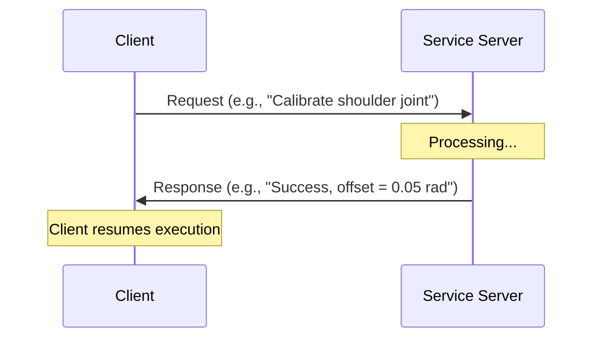
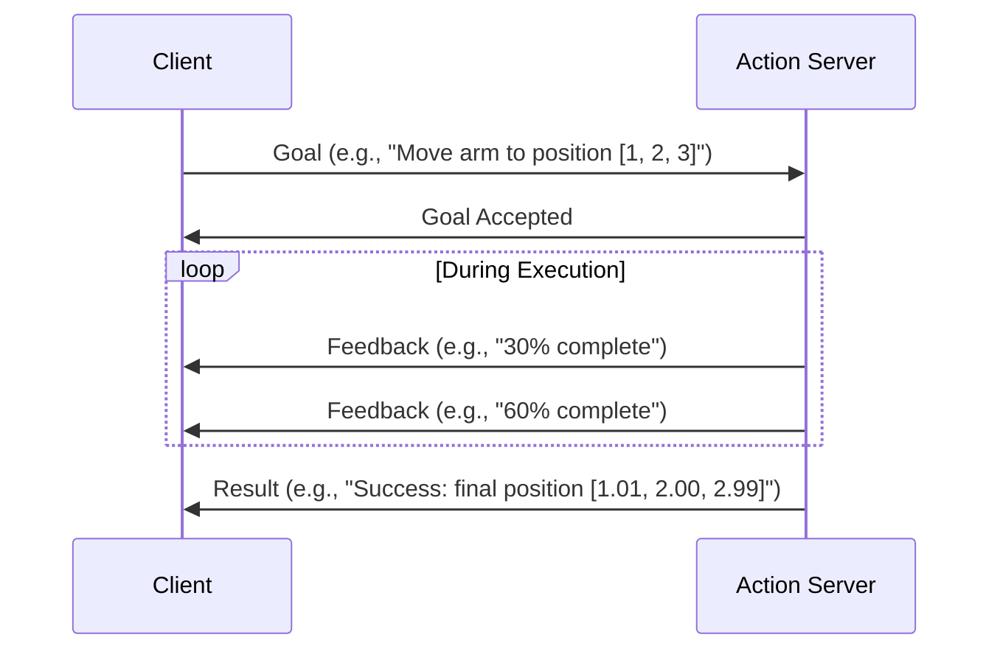

# Chapter 3: Services & Actions

## Learning Objectives

By the end of this chapter, you will be able to:

1. **Explain** the difference between topics, services, and actions
2. **Implement** a ROS 2 service client and server
3. **Implement** a ROS 2 action client and server
4. **Decide** when to use topics vs services vs actions for robot behaviors
5. **Create** a humanoid joint calibration system using services and actions

## Communication Patterns in ROS 2

ROS 2 provides three communication patterns for different use cases:

| Pattern | Direction | Timing | Use Case | Example |
|---------|-----------|--------|----------|---------|
| **Topics** | One-way | Continuous | Streaming data | Camera images, joint states |
| **Services** | Request-reply | One-time | Simple commands | "Get battery level", "Reset odometry" |
| **Actions** | Bidirectional | Long-running | Complex tasks | "Navigate to goal", "Grasp object" |

### When to Use Each Pattern

```
┌─────────────────────────────────────────────────────────┐
│ Decision Tree: Choosing Communication Pattern          │
├─────────────────────────────────────────────────────────┤
│                                                         │
│  Need continuous stream of data?                       │
│       YES → Use TOPIC                                  │
│       NO  ↓                                            │
│                                                         │
│  Task takes more than 1 second?                        │
│       YES → Use ACTION (get feedback + can cancel)     │
│       NO  ↓                                            │
│                                                         │
│  Need a response/result?                               │
│       YES → Use SERVICE                                │
│       NO  → Use TOPIC (one-way message)                │
│                                                         │
└─────────────────────────────────────────────────────────┘
```

**Real-World Analogy**:
- **Topic**: Radio broadcast - anyone can tune in, continuous stream
- **Service**: Phone call - you call, someone answers, call ends
- **Action**: Pizza delivery - you order, get status updates ("preparing", "out for delivery"), can cancel, get final result

## What is a Service?

A **service** is a synchronous request-response pattern. The client sends a request and **waits** for the server to respond.

**Key Properties**:
- **Synchronous**: Client blocks until response arrives
- **One-to-one**: One client talks to one server at a time
- **Fast operations**: Typically < 1 second
- **No feedback**: Just request → response (no progress updates)

### Service Architecture



### Defining a Custom Service

Services use `.srv` files defining request and response fields:

```python title="example_interfaces/srv/AddTwoInts.srv"
# Request
int64 a
int64 b
---
# Response
int64 sum
```

For humanoid robotics, you might create:

```python title="humanoid_interfaces/srv/CalibrateJoint.srv"
# Request
string joint_name       # e.g., "shoulder_pitch"
float64 calibration_time  # seconds to calibrate
---
# Response
bool success
string message
float64 offset_radians
```

## Creating a Service Server

Let's create a joint calibration service for a humanoid robot:

```python title="joint_calibration_server.py" showLineNumbers
#!/usr/bin/env python3

import rclpy
from rclpy.node import Node
from example_interfaces.srv import AddTwoInts  # Using standard service for simplicity
import time

class JointCalibrationServer(Node):
    """
    Service server that calibrates humanoid joints.

    In a real robot, this would move the joint through its range,
    find hard stops, and compute zero position. Here we simulate it.
    """
    def __init__(self):
        super().__init__('joint_calibration_server')

        # Create service
        # Arguments: service_type, service_name, callback_function
        self.srv = self.create_service(
            AddTwoInts,                    # Service type
            'calibrate_joint',             # Service name
            self.calibrate_callback        # Callback function
        )

        self.get_logger().info('Joint calibration service ready')

    def calibrate_callback(self, request, response):
        """
        Called when a client sends a request.

        Args:
            request: AddTwoInts.Request (we'll use 'a' as joint ID)
            response: AddTwoInts.Response (we'll use 'sum' as status code)

        Returns:
            response with computed values
        """
        joint_id = request.a
        calibration_time = request.b

        self.get_logger().info(f'Calibrating joint {joint_id} for {calibration_time}s...')

        # Simulate calibration process
        time.sleep(calibration_time)  # In real robot: move joint, find limits

        # Compute offset (simulated - in reality, this comes from encoder readings)
        offset = 0.05  # radians

        # Set response
        response.sum = 1 if calibration_time > 0 else 0  # 1 = success, 0 = fail

        self.get_logger().info(f'Calibration complete. Offset: {offset} rad')

        return response

def main(args=None):
    rclpy.init(args=args)
    node = JointCalibrationServer()
    rclpy.spin(node)
    rclpy.shutdown()

if __name__ == '__main__':
    main()
```

**Run the service server**:

```bash
python3 joint_calibration_server.py
```

**Expected Output**:
```
[INFO] [joint_calibration_server]: Joint calibration service ready
```

## Creating a Service Client

Now let's create a client that calls the calibration service:

```python title="joint_calibration_client.py" showLineNumbers
#!/usr/bin/env python3

import rclpy
from rclpy.node import Node
from example_interfaces.srv import AddTwoInts

class JointCalibrationClient(Node):
    """
    Service client that requests joint calibration.

    This demonstrates how to make synchronous service calls
    and handle responses.
    """
    def __init__(self):
        super().__init__('joint_calibration_client')

        # Create a client
        # Arguments: service_type, service_name
        self.client = self.create_client(AddTwoInts, 'calibrate_joint')

        # Wait for service to be available
        self.get_logger().info('Waiting for calibration service...')
        while not self.client.wait_for_service(timeout_sec=1.0):
            self.get_logger().info('Service not available, waiting...')

        self.get_logger().info('Service available! Sending request.')

    def send_request(self, joint_id, calibration_time):
        """
        Send a calibration request and wait for response.

        Args:
            joint_id: Integer identifying the joint
            calibration_time: How long to calibrate (seconds)
        """
        # Create request message
        request = AddTwoInts.Request()
        request.a = joint_id
        request.b = calibration_time

        # Call service (this blocks until response arrives)
        self.get_logger().info(f'Requesting calibration for joint {joint_id}...')
        future = self.client.call_async(request)

        # Wait for response
        rclpy.spin_until_future_complete(self, future)

        # Get response
        response = future.result()

        if response.sum == 1:
            self.get_logger().info(f'✓ Calibration successful!')
        else:
            self.get_logger().error(f'✗ Calibration failed!')

        return response

def main(args=None):
    rclpy.init(args=args)
    node = JointCalibrationClient()

    # Calibrate joint 1 for 2 seconds
    node.send_request(joint_id=1, calibration_time=2)

    # Calibrate joint 2 for 3 seconds
    node.send_request(joint_id=2, calibration_time=3)

    node.destroy_node()
    rclpy.shutdown()

if __name__ == '__main__':
    main()
```

**Test the system**:

```bash
# Terminal 1: Run server
python3 joint_calibration_server.py

# Terminal 2: Run client
python3 joint_calibration_client.py
```

**Client Output**:
```
[INFO] [joint_calibration_client]: Waiting for calibration service...
[INFO] [joint_calibration_client]: Service available! Sending request.
[INFO] [joint_calibration_client]: Requesting calibration for joint 1...
[INFO] [joint_calibration_client]: ✓ Calibration successful!
[INFO] [joint_calibration_client]: Requesting calibration for joint 2...
[INFO] [joint_calibration_client]: ✓ Calibration successful!
```

## What is an Action?

An **action** is for long-running tasks that need:
- **Feedback**: Progress updates while task runs
- **Cancellation**: Ability to stop the task mid-execution
- **Result**: Final outcome when task completes

**Key Properties**:
- **Asynchronous**: Client doesn't block - can do other work
- **Feedback loop**: Server sends periodic updates
- **Cancellable**: Client can abort the action
- **Goal-oriented**: Client sends a goal, server works toward it

### Action Architecture



### Defining a Custom Action

Actions use `.action` files with three sections:

```python title="humanoid_interfaces/action/MoveJoint.action"
# Goal
string joint_name
float64 target_position  # radians
float64 max_velocity     # rad/s
---
# Result
bool success
float64 final_position
float64 time_elapsed
---
# Feedback
float64 current_position
float64 progress_percent
```

## Creating an Action Server

Let's create an action server for smooth joint movement:

```python title="move_joint_action_server.py" showLineNumbers
#!/usr/bin/env python3

import rclpy
from rclpy.action import ActionServer
from rclpy.node import Node
from action_tutorials_interfaces.action import Fibonacci  # Using standard action for simplicity
import time

class MoveJointActionServer(Node):
    """
    Action server that moves a humanoid joint to a target position.

    Provides feedback on progress and allows cancellation.
    In a real robot, this would send velocity commands to a motor controller.
    """
    def __init__(self):
        super().__init__('move_joint_action_server')

        # Create action server
        # Arguments: action_type, action_name, execute_callback
        self._action_server = ActionServer(
            self,
            Fibonacci,                    # Action type (using Fibonacci as example)
            'move_joint',                 # Action name
            self.execute_callback         # Callback for executing goal
        )

        self.get_logger().info('Move joint action server ready')

    def execute_callback(self, goal_handle):
        """
        Called when a goal is received.

        Args:
            goal_handle: Handle to the goal (contains goal data, feedback methods)

        Returns:
            result: Final result of the action
        """
        self.get_logger().info('Executing goal...')

        # Get goal parameters
        target_steps = goal_handle.request.order  # Using Fibonacci's 'order' field

        # Create feedback message
        feedback_msg = Fibonacci.Feedback()
        feedback_msg.sequence = [0, 1]

        # Simulate moving joint in steps
        for i in range(1, target_steps):
            # Check if goal was cancelled
            if goal_handle.is_cancel_requested:
                goal_handle.canceled()
                self.get_logger().info('Goal canceled')
                result = Fibonacci.Result()
                result.sequence = feedback_msg.sequence
                return result

            # Compute next position (simulating movement)
            feedback_msg.sequence.append(
                feedback_msg.sequence[i] + feedback_msg.sequence[i-1]
            )

            # Send feedback
            progress = (i / target_steps) * 100
            self.get_logger().info(f'Progress: {progress:.1f}%')
            goal_handle.publish_feedback(feedback_msg)

            # Simulate time for movement
            time.sleep(0.5)

        # Mark goal as succeeded
        goal_handle.succeed()

        # Create result
        result = Fibonacci.Result()
        result.sequence = feedback_msg.sequence

        self.get_logger().info('Goal succeeded!')
        return result

def main(args=None):
    rclpy.init(args=args)
    node = MoveJointActionServer()
    rclpy.spin(node)
    rclpy.shutdown()

if __name__ == '__main__':
    main()
```

## Creating an Action Client

Now let's create a client that sends goals to the action server:

```python title="move_joint_action_client.py" showLineNumbers
#!/usr/bin/env python3

import rclpy
from rclpy.action import ActionClient
from rclpy.node import Node
from action_tutorials_interfaces.action import Fibonacci

class MoveJointActionClient(Node):
    """
    Action client that sends movement goals to the action server.

    Demonstrates:
    - Sending goals
    - Receiving feedback
    - Handling results
    - Cancelling goals
    """
    def __init__(self):
        super().__init__('move_joint_action_client')

        # Create action client
        self._action_client = ActionClient(self, Fibonacci, 'move_joint')

        self.get_logger().info('Waiting for action server...')

    def send_goal(self, target_steps):
        """
        Send a goal to move the joint.

        Args:
            target_steps: Number of steps to move (higher = longer action)
        """
        # Wait for server
        self._action_client.wait_for_server()

        # Create goal message
        goal_msg = Fibonacci.Goal()
        goal_msg.order = target_steps

        self.get_logger().info(f'Sending goal: {target_steps} steps')

        # Send goal and register callbacks
        self._send_goal_future = self._action_client.send_goal_async(
            goal_msg,
            feedback_callback=self.feedback_callback
        )

        self._send_goal_future.add_done_callback(self.goal_response_callback)

    def goal_response_callback(self, future):
        """Called when server accepts or rejects the goal."""
        goal_handle = future.result()

        if not goal_handle.accepted:
            self.get_logger().error('Goal rejected')
            return

        self.get_logger().info('Goal accepted')

        # Get result
        self._get_result_future = goal_handle.get_result_async()
        self._get_result_future.add_done_callback(self.get_result_callback)

    def feedback_callback(self, feedback_msg):
        """Called when server sends feedback."""
        feedback = feedback_msg.feedback
        self.get_logger().info(f'Received feedback: {feedback.sequence[-3:]}...')

    def get_result_callback(self, future):
        """Called when action completes."""
        result = future.result().result
        self.get_logger().info(f'Result: {result.sequence[-5:]}')
        rclpy.shutdown()

def main(args=None):
    rclpy.init(args=args)
    node = MoveJointActionClient()

    # Send goal to move joint in 10 steps
    node.send_goal(10)

    rclpy.spin(node)

if __name__ == '__main__':
    main()
```

**Test the action system**:

```bash
# Terminal 1: Run action server
python3 move_joint_action_server.py

# Terminal 2: Run action client
python3 move_joint_action_client.py
```

**Client Output**:
```
[INFO] [move_joint_action_client]: Waiting for action server...
[INFO] [move_joint_action_client]: Sending goal: 10 steps
[INFO] [move_joint_action_client]: Goal accepted
[INFO] [move_joint_action_client]: Received feedback: [0, 1, 1]...
[INFO] [move_joint_action_client]: Received feedback: [1, 1, 2]...
[INFO] [move_joint_action_client]: Received feedback: [1, 2, 3]...
[INFO] [move_joint_action_client]: Result: [21, 34, 55]
```

## Command-Line Interaction

ROS 2 provides CLI tools for testing services and actions:

```bash
# List all services
ros2 service list

# Call a service manually
ros2 service call /calibrate_joint example_interfaces/srv/AddTwoInts "{a: 1, b: 2}"

# List all actions
ros2 action list

# Send an action goal manually
ros2 action send_goal /move_joint action_tutorials_interfaces/action/Fibonacci "{order: 5}"

# Get action info
ros2 action info /move_joint
```

## Comparison Table: Topics vs Services vs Actions

| Feature | Topic | Service | Action |
|---------|-------|---------|--------|
| **Pattern** | Pub/Sub | Request/Reply | Goal-Feedback-Result |
| **Blocking?** | No | Yes (client waits) | No (async) |
| **Feedback?** | No | No | Yes |
| **Cancellable?** | N/A | No | Yes |
| **Multiple subscribers?** | Yes | No | No |
| **Use case** | Continuous data | Quick commands | Long tasks |
| **Example** | Camera stream | "Get battery %" | "Navigate to kitchen" |

## Hands-On Exercises

Ready to practice? Complete these exercises:

1. **[Exercise 2: Publisher-Subscriber System](./exercises/ex2-publisher-subscriber)** (1 hour)
   - Extend with service for resetting joint positions

2. **[Exercise 3: Build Humanoid URDF Model](./exercises/ex3-urdf-humanoid)** (2 hours)
   - Use actions for smooth joint movements in simulation

## Comprehension Questions

**Question 7**: When would you choose a service over a topic?

<details>
<summary>Click to reveal answer</summary>

**Answer**: Use a **service** when you need a **request-response** interaction and the operation is **quick** (< 1 second). Examples:
- "Get current battery level" - needs a response, quick
- "Reset odometry" - needs confirmation, quick
- "Set robot name" - needs success/failure response

Use a **topic** when you need **continuous streaming** or **one-way** messages without needing a response. Examples:
- Publishing sensor data (camera, LiDAR) - continuous stream
- Sending velocity commands - continuous, no response needed

</details>

---

**Question 8**: What are the three components of an action, and why is each important?

<details>
<summary>Click to reveal answer</summary>

**Answer**:
1. **Goal**: What you want the action to achieve (e.g., "move arm to [x, y, z]"). This tells the server what to do.

2. **Feedback**: Progress updates during execution (e.g., "50% complete", "current position: [x, y, z]"). This lets the client monitor progress and provide UI updates.

3. **Result**: Final outcome when the action completes (e.g., "success: true, final error: 0.001m"). This tells the client if the goal was achieved and provides final data.

Without feedback, long tasks would appear frozen. Without result, you wouldn't know if the task succeeded. Without goal, the server wouldn't know what to do!

</details>

---

**Question 9**: Can you cancel a service call halfway through execution?

<details>
<summary>Click to reveal answer</summary>

**Answer**: **No**. Services are synchronous request-response patterns with no built-in cancellation mechanism. Once you call a service, you must wait for it to complete.

If you need cancellation, use an **action** instead. Actions provide a `cancel()` method that the client can call, and the server can check `goal_handle.is_cancel_requested` to gracefully abort.

This is one of the key reasons to choose actions for long-running tasks.

</details>

---

## Next Steps

You've learned the three communication patterns in ROS 2. Next, you'll learn how to control humanoid joints with Python using **rclpy**.

**Next Chapter**: [Python Control for Humanoid Joints](./ch4-rclpy-control) →

---

**Chapter Summary**: ROS 2 provides three communication patterns: **topics** (continuous streaming), **services** (quick request-response), and **actions** (long-running tasks with feedback). Topics are for sensor data and continuous commands. Services are for quick operations that need a response. Actions are for complex behaviors like navigation and manipulation that need progress updates and cancellation. Choose based on: Is it continuous? (topic), Is it quick? (service), Is it long-running? (action).
