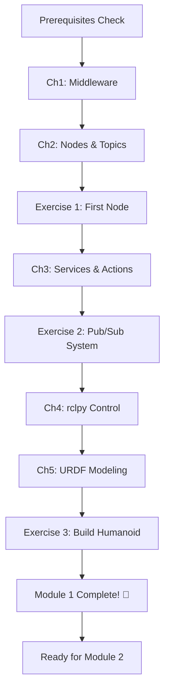

# Module 1: The Robotic Nervous System (ROS 2)

## Module Overview

Welcome to Module 1! In this module, you'll master **ROS 2** (Robot Operating System 2), the middleware that serves as the "nervous system" for modern robots. Just as your nervous system coordinates communication between your brain and muscles, ROS 2 coordinates communication between a robot's sensors, processors, and actuators.

By the end of this module, you'll be able to create ROS 2 nodes that control humanoid robot joints, understand how robots communicate using topics and services, and build robot models using URDF.

## Learning Outcomes

After completing Module 1, you will be able to:

1. **Explain** what middleware is and why robotics needs ROS 2
2. **Create** ROS 2 nodes using Python (`rclpy`)
3. **Implement** publishers and subscribers for robot communication
4. **Use** services and actions for complex robot behaviors
5. **Control** humanoid robot joints using position and velocity commands
6. **Build** URDF models describing a humanoid robot's physical structure
7. **Visualize** robots in RViz2 and verify kinematic chains

## Why ROS 2?

**ROS 2** is the successor to ROS 1, redesigned for:
- **Real-time performance** - Deterministic communication for safety-critical robots
- **Scalability** - Support for multi-robot systems and distributed computing
- **Security** - Built-in encryption and authentication
- **Cross-platform** - Works on Linux, Windows, and macOS

Nearly all modern humanoid robots use ROS 2 or compatible middleware.

## Module Structure

This module contains **5 chapters** and **3 hands-on exercises**:

### Chapters

1. **[ROS 2 Middleware Fundamentals](./ch1-middleware)** (~15 min)
   - What is middleware and why robots need it
   - ROS 2 vs ROS 1 architecture
   - DDS (Data Distribution Service) overview

2. **[Nodes & Topics](./ch2-nodes-topics)** (~18 min)
   - Creating ROS 2 nodes
   - Publisher/subscriber communication pattern
   - Building a humanoid joint controller

3. **[Services & Actions](./ch3-services-actions)** (~16 min)
   - Request/response with services
   - Long-running tasks with actions
   - When to use topics vs services vs actions

4. **[Python Control for Humanoid Joints](./ch4-rclpy-control)** (~17 min)
   - Position control vs velocity control
   - rclpy API for robot control
   - PID controllers for smooth motion

5. **[URDF Modeling](./ch5-urdf-modeling)** (~19 min)
   - URDF syntax for robot description
   - Links, joints, and kinematic chains
   - Building a simple humanoid model
   - Visualization in RViz2

### Hands-On Exercises

**Time Investment**: 3.5 hours total

1. **[Create Your First ROS 2 Node](./exercises/ex1-first-node)** (30 min) - Guided
   - Basic node creation and logging

2. **[Publisher-Subscriber System](./exercises/ex2-publisher-subscriber)** (1 hour) - Intermediate
   - Build a joint command publisher and state subscriber

3. **[Build a Humanoid URDF Model](./exercises/ex3-urdf-humanoid)** (2 hours) - Open-Ended
   - Design a simple humanoid robot with arms and legs

Solutions and grading rubrics available in `/solutions/module-1/`

## Prerequisites

Before starting Module 1, ensure you have:

- ✅ Basic Python programming knowledge
- ✅ Linux terminal navigation skills
- ✅ ROS 2 Humble installed (see [Prerequisites Guide](../appendix/prerequisites))

**Installation Check**:
```bash
ros2 --version
# Should show: ros2 cli version: humble
```

## Estimated Time

- **Reading**: 85 minutes (~15-20 min per chapter)
- **Exercises**: 3.5 hours
- **Code Experimentation**: 2-3 hours
- **Total**: 2-3 weeks for deep understanding (or 1 week fast-paced)

## Learning Path



## Module 1 Success Criteria

You've mastered Module 1 when you can:

- ✅ Create a ROS 2 node that publishes joint commands
- ✅ Explain the difference between topics, services, and actions
- ✅ Control a simulated humanoid joint (shoulder, knee, etc.)
- ✅ Build a basic URDF model and visualize it in RViz
- ✅ Complete all 3 exercises with working solutions

## What's Next?

After completing Module 1, you'll be ready for:

- **Module 2**: Simulate your humanoid in Gazebo with realistic physics
- **Module 3**: Use NVIDIA Isaac for photorealistic environments and AI perception
- **Module 4**: Add voice control and LLM-based planning

---

**Ready to begin?** Start with [Chapter 1: ROS 2 Middleware Fundamentals](./ch1-middleware) →
