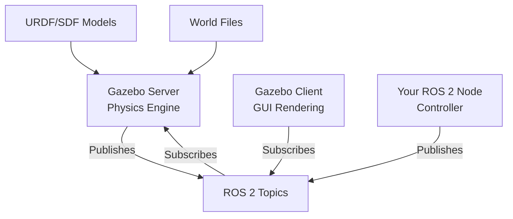

# Chapter 1: Gazebo Basics

## Learning Objectives

By the end of this chapter, you will be able to:

1. **Explain** what Gazebo is and why roboticists use it
2. **Launch** Gazebo with empty and custom worlds
3. **Navigate** the Gazebo GUI (camera controls, model insertion, time control)
4. **Create** basic SDF world files with ground planes and simple objects
5. **Understand** the relationship between Gazebo, ROS 2, and URDF

## What is Gazebo?

**Gazebo** is an open-source 3D robotics simulator that provides:

- **Accurate physics** - Simulates gravity, friction, collisions, inertia
- **Sensor simulation** - LiDAR, cameras, IMU, force/torque sensors
- **ROS 2 integration** - Seamless communication via topics/services
- **Plugin system** - Extend functionality with custom C++ plugins
- **Rendering** - 3D visualization with shadows, textures, lighting

### Gazebo vs Real World

```
Real Robot Workflow:
Design → Build → Test → [Break?] → Repair → Repeat
Cost: $10,000+ per iteration
Time: Weeks to months

Simulation Workflow:
Design → Simulate → Test → Iterate
Cost: $0 per iteration
Time: Minutes to hours
```

**Use simulation to**:
- Test dangerous scenarios safely
- Run thousands of trials overnight
- Validate algorithms before hardware deployment
- Train AI models with synthetic data

### Gazebo Architecture



- **Server** - Runs physics simulation (can run headless)
- **Client** - Renders 3D visualization
- **ROS 2 bridge** - `gazebo_ros_pkgs` connects Gazebo ↔ ROS 2

## Installing Gazebo 11 (Classic)

**Note**: We use Gazebo 11 (Classic), not the newer "Gazebo" (formerly Ignition), because:
- Better ROS 2 Humble support
- More mature plugin ecosystem
- Easier URDF integration

**Installation** (Ubuntu 22.04):

```bash
# Install Gazebo 11
sudo apt update
sudo apt install gazebo11 libgazebo11-dev

# Install ROS 2 Gazebo packages
sudo apt install ros-humble-gazebo-ros-pkgs

# Verify installation
gazebo --version
# Should show: Gazebo multi-robot simulator, version 11.x.x
```

## Launching Gazebo

### Empty World

The simplest way to start Gazebo:

```bash
# Launch Gazebo with GUI
gazebo

# Launch headless (server only, no GUI)
gzserver

# Launch GUI separately (connects to running server)
gzclient
```

**What you see**:
- Empty gray ground plane
- Grid lines for scale
- Default lighting (sun)

### Launching with ROS 2

For ROS 2 integration, use launch files:

```bash
# Launch Gazebo through ROS 2
ros2 launch gazebo_ros gazebo.launch.py
```

This starts:
1. `gzserver` - Physics simulation
2. `gzclient` - 3D rendering
3. ROS 2 bridge - Topic/service connections

## Gazebo GUI Overview

### Main Interface Elements

```
┌─────────────────────────────────────────────────────┐
│  File  Edit  Camera  View  Window  Help             │
├─────────────────────────────────────────────────────┤
│  🔲 📦 💡 🎥  [Timeline] ▶️ ⏸️ ⏹️  [Time: 0.000s]  │
├─────────────────────────────────────────────────────┤
│                                                     │
│              3D Viewport                            │
│         (Rendered scene here)                       │
│                                                     │
├─────────────────────────────────────────────────────┤
│  World  Models  Insert                              │
│  └─ ground_plane                                    │
│  └─ sun                                             │
└─────────────────────────────────────────────────────┘
```

### Toolbar Actions

- **🔲 Select** - Click objects to select/move
- **📦 Box** - Insert box primitive
- **💡 Sphere** - Insert sphere primitive
- **🎥 Cylinder** - Insert cylinder primitive

### Camera Controls

**Mouse navigation**:
- **Left-click + drag** - Rotate camera (orbit)
- **Middle-click + drag** - Pan camera (translate)
- **Scroll wheel** - Zoom in/out
- **Shift + left-click** - Look at object

**Keyboard shortcuts**:
- **W/A/S/D** - Move camera forward/left/back/right
- **Q/E** - Move camera up/down
- **Ctrl+R** - Reset camera view
- **Spacebar** - Pause/unpause simulation

### Time Control

- **▶️ Play** - Start physics simulation
- **⏸️ Pause** - Pause simulation (state preserved)
- **⏹️ Stop** - Reset simulation to t=0
- **Real Time Factor (RTF)** - Displayed in bottom right
  - RTF = 1.0 → Real-time (1 sim second = 1 real second)
  - RTF = 0.5 → Half speed
  - RTF = 2.0 → 2x speed

## Creating a Simple World

### World File Structure (SDF)

Gazebo worlds are defined in **SDF (Simulation Description Format)** - an XML format similar to URDF.

**Minimal world file**:

```xml title="empty_world.world" showLineNumbers
<?xml version="1.0"?>
<sdf version="1.6">
  <world name="empty_world">

    <!-- Physics engine configuration -->
    <physics type="ode">
      <max_step_size>0.001</max_step_size>
      <real_time_factor>1.0</real_time_factor>
    </physics>

    <!-- Lighting -->
    <light name="sun" type="directional">
      <cast_shadows>true</cast_shadows>
      <pose>0 0 10 0 0 0</pose>
      <diffuse>0.8 0.8 0.8 1</diffuse>
      <specular>0.2 0.2 0.2 1</specular>
      <direction>-0.5 0.5 -1.0</direction>
    </light>

    <!-- Ground plane -->
    <model name="ground_plane">
      <static>true</static>
      <link name="link">
        <collision name="collision">
          <geometry>
            <plane>
              <normal>0 0 1</normal>
              <size>100 100</size>
            </plane>
          </geometry>
        </collision>
        <visual name="visual">
          <geometry>
            <plane>
              <normal>0 0 1</normal>
              <size>100 100</size>
            </plane>
          </geometry>
          <material>
            <ambient>0.8 0.8 0.8 1</ambient>
          </material>
        </visual>
      </link>
    </model>

  </world>
</sdf>
```

**Launch this world**:

```bash
gazebo empty_world.world
```

### Adding Objects to the World

Let's add a table and a box:

```xml title="simple_scene.world" showLineNumbers
<?xml version="1.0"?>
<sdf version="1.6">
  <world name="simple_scene">

    <!-- Include standard ground and lighting -->
    <include>
      <uri>model://ground_plane</uri>
    </include>
    <include>
      <uri>model://sun</uri>
    </include>

    <!-- Table -->
    <model name="table">
      <static>true</static>
      <pose>0 0 0.5 0 0 0</pose>  <!-- x y z roll pitch yaw -->
      <link name="link">
        <collision name="collision">
          <geometry>
            <box>
              <size>1.0 0.8 1.0</size>  <!-- width depth height -->
            </box>
          </geometry>
        </collision>
        <visual name="visual">
          <geometry>
            <box>
              <size>1.0 0.8 1.0</size>
            </box>
          </geometry>
          <material>
            <ambient>0.6 0.4 0.2 1</ambient>  <!-- Wood color -->
          </material>
        </visual>
      </link>
    </model>

    <!-- Box on table (dynamic) -->
    <model name="box">
      <pose>0 0 1.1 0 0 0</pose>  <!-- Above table -->
      <link name="link">
        <inertial>
          <mass>1.0</mass>
          <inertia>
            <ixx>0.01</ixx>
            <ixy>0</ixy>
            <ixz>0</ixz>
            <iyy>0.01</iyy>
            <iyz>0</iyz>
            <izz>0.01</izz>
          </inertia>
        </inertial>
        <collision name="collision">
          <geometry>
            <box>
              <size>0.2 0.2 0.2</size>
            </box>
          </geometry>
        </collision>
        <visual name="visual">
          <geometry>
            <box>
              <size>0.2 0.2 0.2</size>
            </box>
          </geometry>
          <material>
            <ambient>1 0 0 1</ambient>  <!-- Red -->
          </material>
        </visual>
      </link>
    </model>

  </world>
</sdf>
```

**Key concepts**:
- **`<static>true</static>`** - Object doesn't move (infinite mass)
- **`<pose>`** - Position (x,y,z) and orientation (roll,pitch,yaw) in radians
- **`<inertial>`** - Required for dynamic objects (non-static)
- **`<collision>`** - Geometry for physics calculations
- **`<visual>`** - Geometry for rendering (can be different from collision)

### Using Gazebo Model Database

Gazebo includes pre-built models:

```xml
<!-- Insert a chair from the model database -->
<include>
  <uri>model://cafe_table</uri>
  <pose>2 0 0 0 0 0</pose>
</include>
```

**Browse models**:
- GUI: Click "Insert" tab → Select model → Click in scene
- Online: http://models.gazebosim.org/

## ROS 2 Launch Files for Gazebo

Instead of manually launching Gazebo, use ROS 2 launch files for better control:

```python title="gazebo_world.launch.py" showLineNumbers
#!/usr/bin/env python3

import os
from launch import LaunchDescription
from launch.actions import IncludeLaunchDescription
from launch.launch_description_sources import PythonLaunchDescriptionSource
from launch_ros.substitutions import FindPackageShare

def generate_launch_description():

    # Path to your world file
    world_file = os.path.join(
        os.getcwd(),
        'worlds',
        'simple_scene.world'
    )

    # Include Gazebo launch file
    gazebo_launch = IncludeLaunchDescription(
        PythonLaunchDescriptionSource([
            FindPackageShare('gazebo_ros'),
            '/launch/gazebo.launch.py'
        ]),
        launch_arguments={
            'world': world_file,
            'verbose': 'true',
            'pause': 'false',
        }.items()
    )

    return LaunchDescription([
        gazebo_launch,
    ])
```

**Launch**:

```bash
ros2 launch gazebo_world.launch.py
```

## Gazebo Topics and Services

Once Gazebo is running with ROS 2, it exposes topics and services:

```bash
# List all Gazebo topics
ros2 topic list | grep gazebo

# Common topics:
# /gazebo/link_states        - Positions of all links
# /gazebo/model_states       - Positions of all models
# /clock                     - Simulation time

# List Gazebo services
ros2 service list | grep gazebo

# Common services:
# /gazebo/spawn_entity       - Spawn a model
# /gazebo/delete_entity      - Remove a model
# /gazebo/pause_physics      - Pause simulation
# /gazebo/unpause_physics    - Resume simulation
```

### Spawning a Model via ROS 2

```bash
# Spawn a box at position (0, 0, 1)
ros2 service call /spawn_entity gazebo_msgs/srv/SpawnEntity \
  '{name: "my_box", xml: "<?xml version=\"1.0\"?><sdf version=\"1.6\"><model name=\"box\"><static>false</static><link name=\"link\"><collision name=\"collision\"><geometry><box><size>0.5 0.5 0.5</size></box></geometry></collision><visual name=\"visual\"><geometry><box><size>0.5 0.5 0.5</size></box></geometry></visual></link></model></sdf>", initial_pose: {position: {x: 0.0, y: 0.0, z: 1.0}}}'
```

## Hands-On Exercise

**Try this**:

1. Launch Gazebo:
   ```bash
   gazebo
   ```

2. Insert a sphere (toolbar → sphere icon)

3. Click play (▶️) and watch it fall

4. Add more objects and observe collisions

5. Try camera controls:
   - Orbit: Left-click + drag
   - Zoom: Scroll wheel

## Common Issues and Solutions

### Issue: Gazebo crashes on launch

**Solution**:
```bash
# Update graphics drivers
# OR run without shadows:
gazebo --verbose
```

### Issue: Models appear black/no lighting

**Solution**: Check that `<light>` element exists in world file, or include:
```xml
<include>
  <uri>model://sun</uri>
</include>
```

### Issue: "Real Time Factor" is low (< 0.5)

**Cause**: Physics simulation is slower than real-time (CPU too slow or scene too complex)

**Solutions**:
- Reduce `max_step_size` in physics config
- Simplify collision geometry
- Use faster physics engine (ODE → Bullet)

## Comprehension Questions

**Question 1**: What is the difference between `gzserver` and `gzclient`?

<details>
<summary>Click to reveal answer</summary>

**Answer**:
- **`gzserver`**: Runs the physics simulation (ODE/Bullet engine). This is the "brain" that computes forces, collisions, sensor readings. Can run headless (no GUI) for faster simulation or batch processing.

- **`gzclient`**: Renders the 3D visualization. This is the "eyes" that displays the scene using OpenGL/OGRE. Connects to a running `gzserver` over network sockets.

You can run `gzserver` on a powerful server and connect multiple `gzclient` instances from different machines to view the same simulation.

</details>

---

**Question 2**: Why do we specify both `<collision>` and `<visual>` geometry?

<details>
<summary>Click to reveal answer</summary>

**Answer**:
- **`<collision>`**: Used by the physics engine for collision detection. Should be **simple** (boxes, spheres, cylinders) for performance. Complex meshes slow down physics.

- **`<visual>`**: Used for rendering. Can be **detailed meshes** for realistic appearance without affecting performance.

**Example**: A robot arm might use:
- Collision: Simple cylinders
- Visual: Detailed mesh with textures

This separation allows fast physics with beautiful visuals.

</details>

---

**Question 3**: What does `<static>true</static>` do?

<details>
<summary>Click to reveal answer</summary>

**Answer**: Marks a model as **static** (immovable). Static models:
- Have infinite mass (cannot be pushed)
- Don't participate in physics calculations (faster simulation)
- Don't need `<inertial>` properties

Use for: Walls, floors, buildings, fixed furniture.

Don't use for: Robots, movable objects, anything that should respond to forces.

</details>

---

## Next Steps

You've learned Gazebo fundamentals! Next, you'll integrate URDF models from Module 1 into Gazebo with physics.

**Next Chapter**: [Physics & URDF in Gazebo](./ch2-physics-urdf) →

---

**Chapter Summary**: Gazebo is a 3D robotics simulator with accurate physics, sensor simulation, and ROS 2 integration. It consists of `gzserver` (physics) and `gzclient` (rendering). World files use SDF format to define environments, lighting, and objects. Models have collision geometry (for physics) and visual geometry (for rendering). Static models don't move; dynamic models require inertial properties. Launch Gazebo via `gazebo` command or ROS 2 launch files for better integration.
