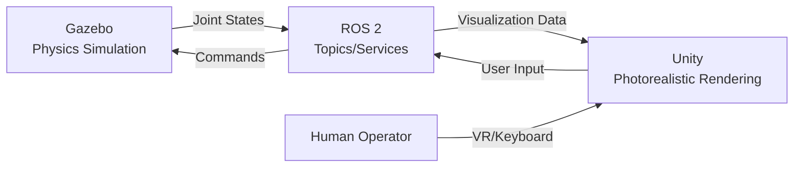

# Chapter 3: Unity for HRI Visualization

## Learning Objectives

By the end of this chapter, you will be able to:

1. **Explain** when to use Unity vs Gazebo for robot simulation
2. **Install** Unity with the ROS-TCP-Connector package
3. **Import** URDF models into Unity scenes
4. **Connect** Unity to ROS 2 for bidirectional communication
5. **Build** photorealistic HRI (Human-Robot Interaction) scenarios

## Unity vs Gazebo: When to Use Each

### Gazebo Strengths

✅ **Accurate physics** - ODE/Bullet engines for realistic dynamics
✅ **ROS 2 native integration** - Topics, services, actions work seamlessly
✅ **Sensor simulation** - LiDAR, depth cameras, IMU with noise models
✅ **Headless operation** - Run without GUI for batch experiments
✅ **Open source** - Free, well-documented, large community

**Use Gazebo for**: Algorithm development, physics testing, autonomous navigation

### Unity Strengths

✅ **Photorealistic rendering** - Advanced lighting, shadows, reflections (HDRP)
✅ **Asset ecosystem** - Thousands of 3D models (furniture, humans, environments)
✅ **Animation tools** - Humanoid avatars, character controllers
✅ **VR/AR support** - Deploy to Oculus, HoloLens, mobile AR
✅ **Fast iteration** - Visual editor, play mode testing

**Use Unity for**: HRI studies, user testing, telepresence, VR applications

### The Best of Both Worlds



**Typical pipeline**:
1. Run physics in Gazebo (accurate dynamics)
2. Stream robot state to Unity (beautiful visualization)
3. Capture user commands in Unity (VR controllers, GUI)
4. Send commands back to Gazebo via ROS 2

## Installing Unity for Robotics

### System Requirements

- **OS**: Windows 10/11, macOS, or Ubuntu 20.04+
- **Unity Version**: 2022.3 LTS or newer
- **GPU**: NVIDIA/AMD with 4GB+ VRAM (for HDRP)
- **RAM**: 16GB+ recommended

### Installation Steps

**1. Install Unity Hub**:

```bash
# Ubuntu (via Snap)
sudo snap install unity-hub --classic

# OR download from: https://unity.com/download
```

**2. Install Unity Editor 2022.3 LTS**:

- Open Unity Hub
- Go to "Installs" → "Install Editor"
- Select "2022.3 LTS" (Long-Term Support)
- Add modules:
  - ✅ Linux Build Support (if on Windows/Mac)
  - ✅ Documentation
  - ✅ Visual Studio (for scripting)

**3. Create New Project**:

- Click "New Project"
- Template: **3D (URP)** or **3D (HDRP)** for photorealism
- Name: `HumanoidHRI`
- Location: Choose directory
- Click "Create Project"

## Installing ROS-TCP-Connector

The **ROS-TCP-Connector** bridges Unity ↔ ROS 2 communication.

### Unity Side Setup

**1. Add Package from Git URL**:

In Unity Editor:
1. Window → Package Manager
2. Click "+" → "Add package from git URL"
3. Enter: `https://github.com/Unity-Technologies/ROS-TCP-Connector.git?path=/com.unity.robotics.ros-tcp-connector`
4. Click "Add"

**2. Add URDF Importer**:

Same process:
- Git URL: `https://github.com/Unity-Technologies/URDF-Importer.git?path=/com.unity.robotics.urdf-importer`

**3. Configure ROS Settings**:

In Unity:
1. Robotics → ROS Settings
2. Set **Protocol**: ROS 2
3. Set **ROS IP Address**: `127.0.0.1` (localhost) or your ROS machine IP
4. Set **ROS Port**: `10000` (default)
5. Click "Save"

### ROS 2 Side Setup

**Install ROS TCP Endpoint**:

```bash
# Create workspace
mkdir -p ~/ros2_ws/src
cd ~/ros2_ws/src

# Clone ROS TCP Endpoint
git clone https://github.com/Unity-Technologies/ROS-TCP-Endpoint.git

# Build
cd ~/ros2_ws
colcon build --packages-select ros_tcp_endpoint

# Source
source install/setup.bash
```

**Launch ROS TCP Endpoint**:

```bash
ros2 run ros_tcp_endpoint default_server_endpoint --ros-args -p ROS_IP:=0.0.0.0
```

**Expected output**:
```
[INFO] [ros_tcp_endpoint]: Starting server on 0.0.0.0:10000
[INFO] [ros_tcp_endpoint]: Waiting for connections...
```

## Importing URDF into Unity

### Method 1: Via Unity Editor

**1. Prepare URDF**:

Ensure your URDF has:
- Relative paths to mesh files
- Meshes in supported formats (`.stl`, `.dae`, `.obj`)

```xml
<!-- Good: Relative path -->
<mesh filename="package://my_robot/meshes/torso.stl"/>

<!-- Bad: Absolute path -->
<mesh filename="/home/user/robots/torso.stl"/>
```

**2. Import in Unity**:

1. Assets → Import Robot from URDF
2. Select your `.urdf` file
3. Choose import settings:
   - **Y Axis Type**: Z-Up (ROS convention)
   - **Mesh Decomposer**: Mesh Collider (simple) or VHACD (accurate)
4. Click "Import"

**3. Fix Materials** (Unity makes them gray by default):

1. Select imported robot in Hierarchy
2. For each child link:
   - Inspector → Mesh Renderer → Materials
   - Drag a material from Project (or create new)

### Method 2: Runtime Import via Script

```csharp title="RuntimeURDFLoader.cs" showLineNumbers
using UnityEngine;
using Unity.Robotics.UrdfImporter;

public class RuntimeURDFLoader : MonoBehaviour
{
    public string urdfFilePath = "Assets/URDF/humanoid.urdf";

    void Start()
    {
        // Import URDF at runtime
        UrdfRobot robot = UrdfRobotExtensions.Create(urdfFilePath);

        if (robot != null)
        {
            Debug.Log($"Loaded robot: {robot.name}");

            // Set position
            robot.transform.position = new Vector3(0, 0, 0);

            // Enable physics
            robot.SetRigidbodyComponents();
        }
        else
        {
            Debug.LogError("Failed to load URDF!");
        }
    }
}
```

Attach this script to an empty GameObject in your scene.

## ROS 2 ↔ Unity Communication

### Publishing from Unity to ROS 2

Send joint commands from Unity UI to ROS 2:

```csharp title="UnityToROS.cs" showLineNumbers
using UnityEngine;
using Unity.Robotics.ROSTCPConnector;
using RosMessageTypes.Std;

public class UnityToROS : MonoBehaviour
{
    private ROSConnection ros;
    private string topicName = "/unity/joint_command";

    void Start()
    {
        // Get ROS connection
        ros = ROSConnection.GetOrCreateInstance();

        // Register publisher
        ros.RegisterPublisher<Float64Msg>(topicName);

        Debug.Log($"Publishing to {topicName}");
    }

    void Update()
    {
        // Press SPACE to send command
        if (Input.GetKeyDown(KeyCode.Space))
        {
            Float64Msg msg = new Float64Msg
            {
                data = 1.57  // 90 degrees
            };

            ros.Publish(topicName, msg);
            Debug.Log("Published joint command: 1.57 rad");
        }
    }
}
```

**Verify in ROS 2**:

```bash
ros2 topic echo /unity/joint_command
```

### Subscribing in Unity from ROS 2

Receive robot state from Gazebo and visualize in Unity:

```csharp title="ROSToUnity.cs" showLineNumbers
using UnityEngine;
using Unity.Robotics.ROSTCPConnector;
using RosMessageTypes.Sensor;

public class ROSToUnity : MonoBehaviour
{
    private ROSConnection ros;
    private string topicName = "/joint_states";

    public Transform shoulderJoint;

    void Start()
    {
        ros = ROSConnection.GetOrCreateInstance();

        // Subscribe to joint states
        ros.Subscribe<JointStateMsg>(topicName, UpdateJointStates);

        Debug.Log($"Subscribed to {topicName}");
    }

    void UpdateJointStates(JointStateMsg msg)
    {
        // Find "shoulder_pitch" joint
        for (int i = 0; i < msg.name.Length; i++)
        {
            if (msg.name[i] == "shoulder_pitch")
            {
                float angle = (float)msg.position[i];

                // Apply rotation (convert rad to degrees)
                shoulderJoint.localRotation = Quaternion.Euler(
                    0,
                    angle * Mathf.Rad2Deg,
                    0
                );

                Debug.Log($"Shoulder angle: {angle} rad");
                break;
            }
        }
    }
}
```

**Assign in Unity**:
1. Attach script to GameObject
2. Drag shoulder joint Transform to `shoulderJoint` field in Inspector

## Building a Simple HRI Scene

### Scene Setup

**1. Create Environment**:

```
Hierarchy:
  - Ground (Plane)
  - Lighting (Directional Light)
  - Camera (Main Camera)
  - Robot (Imported URDF)
  - Human Avatar (from Asset Store or Mixamo)
```

**2. Add Realistic Materials** (HDRP):

1. Right-click Project → Create → Material
2. Inspector → Shader: HDRP/Lit
3. Configure:
   - **Base Map**: Texture (Albedo)
   - **Metallic**: 0 (plastic/wood) or 1 (metal)
   - **Smoothness**: 0 (rough) to 1 (polished)

**3. Add HDRI Lighting**:

1. Download HDRI from https://polyhaven.com/hdris
2. Create material with HDRI texture
3. Window → Rendering → Lighting
4. Environment → Skybox Material → Assign HDRI material

### Interactive Demo: VR Teleoperation

**Control robot via VR headset**:

```csharp title="VRTeleop.cs" showLineNumbers
using UnityEngine;
using Unity.Robotics.ROSTCPConnector;
using RosMessageTypes.Geometry;
using UnityEngine.XR;

public class VRTeleop : MonoBehaviour
{
    private ROSConnection ros;
    private string topicName = "/cmd_vel";

    public XRNode leftHand = XRNode.LeftHand;
    public XRNode rightHand = XRNode.RightHand;

    void Start()
    {
        ros = ROSConnection.GetOrCreateInstance();
        ros.RegisterPublisher<TwistMsg>(topicName);
    }

    void Update()
    {
        // Get VR controller input
        Vector3 leftPos = GetControllerPosition(leftHand);
        Vector3 rightPos = GetControllerPosition(rightHand);

        // Map to robot velocity
        float linear = leftPos.z * 0.5f;  // Forward/backward
        float angular = (rightPos.x - leftPos.x) * 0.3f;  // Turn

        // Publish to ROS
        TwistMsg twist = new TwistMsg
        {
            linear = new Vector3Msg { x = linear, y = 0, z = 0 },
            angular = new Vector3Msg { x = 0, y = 0, z = angular }
        };

        ros.Publish(topicName, twist);
    }

    Vector3 GetControllerPosition(XRNode node)
    {
        InputDevice device = InputDevices.GetDeviceAtXRNode(node);
        Vector3 position;
        if (device.TryGetFeatureValue(CommonUsages.devicePosition, out position))
        {
            return position;
        }
        return Vector3.zero;
    }
}
```

## Optimization Tips

### Performance

**1. Level of Detail (LOD)**:

For distant robots, use simpler meshes:

```csharp
LODGroup lodGroup = robot.AddComponent<LODGroup>();
LOD[] lods = new LOD[3];
lods[0] = new LOD(0.5f, highDetailRenderers);  // Close
lods[1] = new LOD(0.15f, medDetailRenderers);  // Medium
lods[2] = new LOD(0.01f, lowDetailRenderers);  // Far
lodGroup.SetLODs(lods);
```

**2. Occlusion Culling**:

Don't render objects behind walls:

1. Window → Rendering → Occlusion Culling
2. Select static objects → Mark as "Occluder Static"
3. Click "Bake"

**3. Limit ROS Message Rate**:

```csharp
private float publishInterval = 0.1f;  // 10 Hz instead of 60 Hz
private float lastPublishTime = 0f;

void Update()
{
    if (Time.time - lastPublishTime > publishInterval)
    {
        PublishMessage();
        lastPublishTime = Time.time;
    }
}
```

## Common Issues and Solutions

### Issue: URDF Import Fails

**Cause**: Unsupported mesh format or broken paths

**Solution**:
1. Convert meshes to `.stl` or `.dae`
2. Use relative paths: `package://robot/meshes/file.stl`
3. Place meshes in `Assets/URDF/meshes/`

### Issue: Robot Parts Fly Apart

**Cause**: Unity physics vs Gazebo physics mismatch

**Solution**:
```csharp
// Increase joint stability
ArticulationBody joint = GetComponent<ArticulationBody>();
joint.solverIterations = 20;
joint.solverVelocityIterations = 10;
```

### Issue: ROS Connection Timeout

**Cause**: ROS TCP Endpoint not running or wrong IP

**Solution**:
1. Verify endpoint: `ros2 run ros_tcp_endpoint default_server_endpoint`
2. Check Unity ROS Settings IP matches ROS machine
3. Test connection: `ping <ROS_IP>`

## Hands-On Example

**Complete workflow**:

```bash
# Terminal 1: Launch Gazebo with robot
ros2 launch my_robot gazebo.launch.py

# Terminal 2: Launch ROS TCP Endpoint
ros2 run ros_tcp_endpoint default_server_endpoint

# Terminal 3 (Unity): Press Play in Unity Editor
# Unity will connect and visualize robot state from Gazebo
```

## Comprehension Questions

**Question 7**: When should you use Unity instead of Gazebo?

<details>
<summary>Click to reveal answer</summary>

**Answer**: Use **Unity** when:

1. **Photorealism matters** - User studies, marketing demos, VR telepresence
2. **Human interaction** - HRI experiments with virtual humans
3. **VR/AR** - Oculus, HoloLens, mobile AR applications
4. **Quick prototyping** - Visual editor for fast scene building
5. **Asset-rich environments** - Need furniture, buildings, characters from Asset Store

Stick with **Gazebo** when:
- Physics accuracy is critical
- Running headless batch experiments
- Sensor simulation with noise models
- Standard robot development workflow

**Best approach**: Use both! Gazebo for physics, Unity for visualization.

</details>

---

**Question 8**: What is the ROS-TCP-Connector's role?

<details>
<summary>Click to reveal answer</summary>

**Answer**: The **ROS-TCP-Connector** enables bidirectional communication between Unity (game engine) and ROS 2 (robot middleware) over TCP/IP sockets.

**How it works**:
1. **ROS side**: `ros_tcp_endpoint` runs as a ROS 2 node, exposing TCP server on port 10000
2. **Unity side**: `ROS-TCP-Connector` package connects as TCP client
3. **Messages**: Serialized ROS messages (JSON or binary) sent over TCP
4. **Topics/Services**: Unity can publish, subscribe, call services just like ROS nodes

**Use case**: Control Gazebo robot with Unity VR interface - user moves VR hands → Unity publishes `/cmd_vel` → Gazebo robot moves → Gazebo publishes `/joint_states` → Unity updates visualization.

</details>

---

**Question 9**: Why do imported URDF robots sometimes look gray in Unity?

<details>
<summary>Click to reveal answer</summary>

**Answer**: URDF files specify materials using **Gazebo-specific** color definitions or texture references, but Unity doesn't understand these formats.

**What happens**:
- URDF importer creates mesh geometry correctly
- Materials default to Unity's standard gray shader
- Textures/colors from URDF are ignored

**Solution**:
1. Manually assign Unity materials to each link
2. Create materials with appropriate colors/textures in Unity
3. Use script to auto-apply materials based on URDF color values (advanced)

This is expected behavior - you get accurate geometry, but must add visual polish in Unity's editor.

</details>

---

## Next Steps

You've learned how to use Unity for photorealistic HRI visualization! Next, you'll add sensors (LiDAR, cameras, IMU) to your simulated robots.

**Next Chapter**: [Sensor Simulation](./ch4-sensor-simulation) →

---

**Chapter Summary**: Unity complements Gazebo by providing photorealistic rendering, VR/AR support, and rich asset ecosystems for HRI studies. The ROS-TCP-Connector bridges Unity ↔ ROS 2 via TCP/IP, enabling bidirectional topic/service communication. URDF robots can be imported into Unity scenes but require manual material assignment. Unity excels at visualization and user interaction, while Gazebo handles accurate physics - use both together for the best of both worlds. VR teleoperation and interactive demos are possible by mapping VR controller input to ROS commands.
