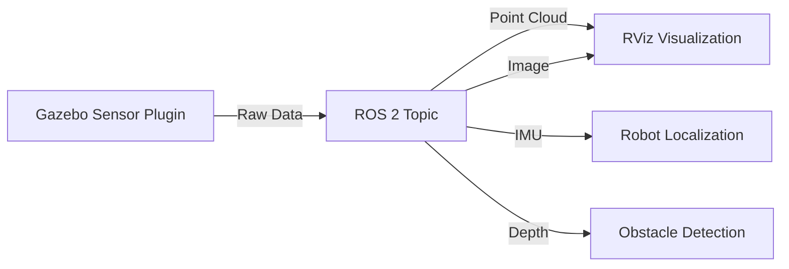

# Chapter 4: Sensor Simulation

## Learning Objectives

By the end of this chapter, you will be able to:

1. **Attach** LiDAR, cameras, and IMU sensors to your robot in Gazebo
2. **Configure** sensor plugins with realistic noise and update rates
3. **Visualize** sensor data in RViz alongside Gazebo
4. **Understand** sensor coordinate frames and transformations
5. **Choose** appropriate sensors for navigation and perception tasks

## Why Simulate Sensors?

### Real Sensors Are Expensive

- **Velodyne VLP-16 LiDAR**: $4,000+
- **Intel RealSense D435 Depth Camera**: $179
- **Xsens IMU**: $1,000+

Simulation lets you test algorithms **before** buying hardware.

### Simulation Benefits

✅ **Perfect ground truth** - Know exact robot position for validation
✅ **Repeatability** - Same scenario every time
✅ **Stress testing** - Extreme conditions (fog, darkness, high speed)
✅ **Rapid iteration** - Change sensor placement in seconds

### Sensor Data Flow



## Sensor Coordinate Frames

### ROS Convention (REP 103)

All ROS sensors follow:
- **X-axis**: Forward
- **Y-axis**: Left
- **Z-axis**: Up

```
     Z
     ↑
     |
     |_____ Y
    /
   /
  X
```

**Rotations**: Roll (X), Pitch (Y), Yaw (Z)

### Adding Frames to URDF

Every sensor needs a link and joint:

```xml
<!-- Camera link -->
<link name="camera_link">
  <visual>
    <geometry>
      <box size="0.02 0.05 0.02"/>
    </geometry>
    <material name="black">
      <color rgba="0 0 0 1"/>
    </material>
  </visual>
</link>

<!-- Joint attaching camera to robot -->
<joint name="camera_joint" type="fixed">
  <parent link="torso"/>
  <child link="camera_link"/>
  <origin xyz="0.1 0 0.3" rpy="0 0 0"/>
  <!-- x,y,z offset + roll,pitch,yaw rotation -->
</joint>
```

## LiDAR Simulation

### What is LiDAR?

**LiDAR (Light Detection and Ranging)** measures distances by emitting laser pulses and timing their return.

**Output**: Point cloud (3D coordinates of detected surfaces)

**Use cases**: Obstacle avoidance, SLAM, navigation

### Adding LiDAR to URDF

```xml title="humanoid_with_lidar.urdf" showLineNumbers
<?xml version="1.0"?>
<robot name="humanoid_lidar">

  <!-- ... previous links (torso, arms, etc.) ... -->

  <!-- LiDAR link -->
  <link name="lidar_link">
    <visual>
      <geometry>
        <cylinder radius="0.05" length="0.07"/>
      </geometry>
      <material name="black">
        <color rgba="0 0 0 1"/>
      </material>
    </visual>
    <collision>
      <geometry>
        <cylinder radius="0.05" length="0.07"/>
      </geometry>
    </collision>
    <inertial>
      <mass value="0.3"/>
      <inertia ixx="0.001" ixy="0" ixz="0"
               iyy="0.001" iyz="0" izz="0.001"/>
    </inertial>
  </link>

  <!-- Attach to head -->
  <joint name="lidar_joint" type="fixed">
    <parent link="head"/>
    <child link="lidar_link"/>
    <origin xyz="0 0 0.1" rpy="0 0 0"/>
  </joint>

  <!-- Gazebo LiDAR plugin -->
  <gazebo reference="lidar_link">
    <sensor name="lidar_sensor" type="ray">
      <pose>0 0 0 0 0 0</pose>
      <visualize>true</visualize>
      <update_rate>10</update_rate>  <!-- 10 Hz -->

      <ray>
        <scan>
          <horizontal>
            <samples>360</samples>
            <resolution>1</resolution>
            <min_angle>-3.14159</min_angle>  <!-- -180 degrees -->
            <max_angle>3.14159</max_angle>   <!-- +180 degrees -->
          </horizontal>
          <vertical>
            <samples>16</samples>  <!-- 16 beams (like VLP-16) -->
            <resolution>1</resolution>
            <min_angle>-0.261799</min_angle>  <!-- -15 degrees -->
            <max_angle>0.261799</max_angle>   <!-- +15 degrees -->
          </vertical>
        </scan>

        <range>
          <min>0.1</min>  <!-- Minimum detection distance (m) -->
          <max>30.0</max>  <!-- Maximum detection distance (m) -->
          <resolution>0.01</resolution>  <!-- 1 cm precision -->
        </range>

        <!-- Add realistic noise -->
        <noise>
          <type>gaussian</type>
          <mean>0.0</mean>
          <stddev>0.01</stddev>  <!-- 1 cm standard deviation -->
        </noise>
      </ray>

      <!-- Publish to ROS 2 topic -->
      <plugin name="gazebo_ros_laser_controller" filename="libgazebo_ros_ray_sensor.so">
        <ros>
          <namespace>/humanoid</namespace>
          <remapping>~/out:=scan</remapping>
        </ros>
        <output_type>sensor_msgs/LaserScan</output_type>
        <frame_name>lidar_link</frame_name>
      </plugin>
    </sensor>
  </gazebo>

</robot>
```

**Key parameters**:
- **`samples`**: Number of rays per scan (more = denser but slower)
- **`min/max_angle`**: Field of view
- **`min/max range`**: Detection limits
- **`update_rate`**: Scans per second (10-40 Hz typical)
- **`noise`**: Gaussian noise to match real sensor accuracy

### Viewing LiDAR Data in RViz

```bash
# Terminal 1: Launch Gazebo with robot
ros2 launch my_robot gazebo.launch.py

# Terminal 2: Launch RViz
rviz2
```

**In RViz**:
1. Add → By topic → `/humanoid/scan` → LaserScan
2. Fixed Frame: `map` or `odom`
3. You should see red dots representing LiDAR hits

## Depth Camera Simulation

### What is a Depth Camera?

Captures both **color image** (RGB) and **depth** (distance to each pixel).

**Examples**: Intel RealSense, Kinect, ZED

**Use cases**: Object detection, 3D reconstruction, grasping

### Adding Depth Camera to URDF

```xml title="depth_camera.urdf" showLineNumbers
<robot name="humanoid_depth_camera">

  <!-- Camera link -->
  <link name="depth_camera_link">
    <visual>
      <geometry>
        <box size="0.025 0.09 0.025"/>
      </geometry>
      <material name="black">
        <color rgba="0 0 0 1"/>
      </material>
    </visual>
    <inertial>
      <mass value="0.07"/>
      <inertia ixx="0.0001" ixy="0" ixz="0"
               iyy="0.0001" iyz="0" izz="0.0001"/>
    </inertial>
  </link>

  <!-- Attach to head -->
  <joint name="depth_camera_joint" type="fixed">
    <parent link="head"/>
    <child link="depth_camera_link"/>
    <origin xyz="0.05 0 0" rpy="0 0 0"/>
  </joint>

  <!-- Optical frame (required for ROS convention) -->
  <link name="depth_camera_optical_frame"/>
  <joint name="depth_camera_optical_joint" type="fixed">
    <parent link="depth_camera_link"/>
    <child link="depth_camera_optical_frame"/>
    <origin xyz="0 0 0" rpy="-1.5708 0 -1.5708"/>
    <!-- Rotate to ROS optical frame convention -->
  </joint>

  <!-- Gazebo depth camera plugin -->
  <gazebo reference="depth_camera_link">
    <sensor name="depth_camera" type="depth">
      <update_rate>30</update_rate>  <!-- 30 FPS -->
      <visualize>true</visualize>

      <camera name="depth_camera">
        <horizontal_fov>1.047</horizontal_fov>  <!-- 60 degrees -->
        <image>
          <width>640</width>
          <height>480</height>
          <format>R8G8B8</format>
        </image>
        <clip>
          <near>0.3</near>  <!-- Min depth -->
          <far>10.0</far>   <!-- Max depth -->
        </clip>

        <!-- Add noise to depth measurements -->
        <noise>
          <type>gaussian</type>
          <mean>0.0</mean>
          <stddev>0.007</stddev>  <!-- 7mm error -->
        </noise>
      </camera>

      <!-- Publish RGB image and depth -->
      <plugin name="depth_camera_controller" filename="libgazebo_ros_camera.so">
        <ros>
          <namespace>/humanoid</namespace>
          <remapping>~/image_raw:=camera/rgb/image_raw</remapping>
          <remapping>~/depth/image_raw:=camera/depth/image_raw</remapping>
          <remapping>~/camera_info:=camera/rgb/camera_info</remapping>
          <remapping>~/depth/camera_info:=camera/depth/camera_info</remapping>
          <remapping>~/points:=camera/depth/points</remapping>
        </ros>
        <frame_name>depth_camera_optical_frame</frame_name>
      </plugin>
    </sensor>
  </gazebo>

</robot>
```

**Published topics**:
- `/humanoid/camera/rgb/image_raw` - Color image (sensor_msgs/Image)
- `/humanoid/camera/depth/image_raw` - Depth image (sensor_msgs/Image)
- `/humanoid/camera/depth/points` - Point cloud (sensor_msgs/PointCloud2)

### Viewing Depth Camera in RViz

**In RViz**:
1. Add → Image → Topic: `/humanoid/camera/rgb/image_raw`
2. Add → PointCloud2 → Topic: `/humanoid/camera/depth/points`
3. Set color transformer to "RGB8" or "Intensity"

## RGB Camera Simulation

Simple color camera (no depth):

```xml
<gazebo reference="camera_link">
  <sensor name="rgb_camera" type="camera">
    <update_rate>30</update_rate>

    <camera name="rgb_camera">
      <horizontal_fov>1.39626</horizontal_fov>  <!-- 80 degrees -->
      <image>
        <width>1280</width>
        <height>720</height>
        <format>R8G8B8</format>
      </image>
      <clip>
        <near>0.05</near>
        <far>100.0</far>
      </clip>
    </camera>

    <plugin name="camera_controller" filename="libgazebo_ros_camera.so">
      <ros>
        <namespace>/humanoid</namespace>
        <remapping>~/image_raw:=camera/image_raw</remapping>
        <remapping>~/camera_info:=camera/camera_info</remapping>
      </ros>
      <frame_name>camera_optical_frame</frame_name>
    </plugin>
  </sensor>
</gazebo>
```

**Use cases**: Object recognition, apriltag detection, visual servoing

## IMU Simulation

### What is an IMU?

**IMU (Inertial Measurement Unit)** measures:
- **Linear acceleration** (3-axis: x, y, z)
- **Angular velocity** (3-axis: roll, pitch, yaw rates)

**Use cases**: Orientation estimation, balance control, odometry fusion

### Adding IMU to URDF

```xml title="imu.urdf" showLineNumbers
<robot name="humanoid_imu">

  <!-- IMU link (usually inside torso) -->
  <link name="imu_link">
    <inertial>
      <mass value="0.015"/>
      <inertia ixx="0.00001" ixy="0" ixz="0"
               iyy="0.00001" iyz="0" izz="0.00001"/>
    </inertial>
  </link>

  <!-- Attach to torso center -->
  <joint name="imu_joint" type="fixed">
    <parent link="torso"/>
    <child link="imu_link"/>
    <origin xyz="0 0 0" rpy="0 0 0"/>
  </joint>

  <!-- Gazebo IMU plugin -->
  <gazebo reference="imu_link">
    <sensor name="imu_sensor" type="imu">
      <always_on>true</always_on>
      <update_rate>100</update_rate>  <!-- 100 Hz -->
      <visualize>false</visualize>

      <imu>
        <!-- Accelerometer noise -->
        <linear_acceleration>
          <x>
            <noise type="gaussian">
              <mean>0.0</mean>
              <stddev>0.01</stddev>  <!-- 0.01 m/s² noise -->
            </noise>
          </x>
          <y>
            <noise type="gaussian">
              <mean>0.0</mean>
              <stddev>0.01</stddev>
            </noise>
          </y>
          <z>
            <noise type="gaussian">
              <mean>0.0</mean>
              <stddev>0.01</stddev>
            </noise>
          </z>
        </linear_acceleration>

        <!-- Gyroscope noise -->
        <angular_velocity>
          <x>
            <noise type="gaussian">
              <mean>0.0</mean>
              <stddev>0.005</stddev>  <!-- 0.005 rad/s noise -->
            </noise>
          </x>
          <y>
            <noise type="gaussian">
              <mean>0.0</mean>
              <stddev>0.005</stddev>
            </noise>
          </y>
          <z>
            <noise type="gaussian">
              <mean>0.0</mean>
              <stddev>0.005</stddev>
            </noise>
          </z>
        </angular_velocity>
      </imu>

      <plugin name="imu_plugin" filename="libgazebo_ros_imu_sensor.so">
        <ros>
          <namespace>/humanoid</namespace>
          <remapping>~/out:=imu/data</remapping>
        </ros>
        <frame_name>imu_link</frame_name>
        <initial_orientation_as_reference>false</initial_orientation_as_reference>
      </plugin>
    </sensor>
  </gazebo>

</robot>
```

**Published topic**:
- `/humanoid/imu/data` (sensor_msgs/Imu)
  - `orientation` - Quaternion (roll, pitch, yaw)
  - `angular_velocity` - rad/s
  - `linear_acceleration` - m/s²

### Visualizing IMU in RViz

```bash
# Echo IMU data
ros2 topic echo /humanoid/imu/data

# In RViz, add "Pose" visualization:
# 1. Add → Pose
# 2. Topic: /humanoid/imu/data (no direct support)
# OR use robot_localization to publish /odometry/filtered
```

## Sensor Configuration Best Practices

### Update Rates

Match real sensor rates:

| Sensor | Typical Rate | Gazebo Setting |
|--------|--------------|----------------|
| LiDAR | 10-40 Hz | `<update_rate>10</update_rate>` |
| RGB Camera | 30-60 FPS | `<update_rate>30</update_rate>` |
| Depth Camera | 15-30 FPS | `<update_rate>30</update_rate>` |
| IMU | 100-400 Hz | `<update_rate>100</update_rate>` |

**Don't** set update_rate higher than necessary (wastes CPU).

### Realistic Noise

Add noise to match real sensor specs:

**LiDAR** (e.g., Velodyne VLP-16):
```xml
<noise>
  <type>gaussian</type>
  <mean>0.0</mean>
  <stddev>0.03</stddev>  <!-- ±3cm accuracy -->
</noise>
```

**Depth Camera** (e.g., RealSense D435):
```xml
<noise>
  <type>gaussian</type>
  <mean>0.0</mean>
  <stddev>0.005</stddev>  <!-- ±5mm at 1m -->
</noise>
```

**IMU** (e.g., MPU-6050):
```xml
<!-- Accelerometer -->
<stddev>0.02</stddev>  <!-- 0.02 m/s² -->

<!-- Gyroscope -->
<stddev>0.01</stddev>  <!-- 0.01 rad/s -->
```

### Field of View

Match real sensor specs:

```xml
<!-- RealSense D435: 87° H x 58° V -->
<horizontal_fov>1.51844</horizontal_fov>  <!-- 87 degrees in radians -->

<!-- Velodyne VLP-16: 360° H x 30° V -->
<min_angle>-3.14159</min_angle>
<max_angle>3.14159</max_angle>
```

## Multi-Sensor Fusion

### Launch File with All Sensors

```python title="sensors.launch.py" showLineNumbers
from launch import LaunchDescription
from launch_ros.actions import Node

def generate_launch_description():
    return LaunchDescription([
        # Robot state publisher
        Node(
            package='robot_state_publisher',
            executable='robot_state_publisher',
            parameters=[{'robot_description': open('humanoid_sensors.urdf').read()}]
        ),

        # Sensor fusion with robot_localization
        Node(
            package='robot_localization',
            executable='ekf_node',
            name='ekf_filter_node',
            parameters=[{
                'frequency': 30.0,
                'sensor_timeout': 0.1,
                'two_d_mode': False,
                'odom0': '/gazebo/ground_truth',
                'imu0': '/humanoid/imu/data',
                'odom0_config': [True] * 15,  # Use all odom data
                'imu0_config': [False] * 6 + [True] * 9,  # Use orientation + velocities
            }],
            remappings=[('odometry/filtered', '/odometry/filtered')]
        ),
    ])
```

## Comprehension Questions

**Question 10**: Why do depth cameras need an "optical frame"?

<details>
<summary>Click to reveal answer</summary>

**Answer**: Camera images in computer vision use a different coordinate convention than ROS:

**Camera (OpenCV) convention**:
- X-axis: Right
- Y-axis: Down
- Z-axis: Forward (into scene)

**ROS convention**:
- X-axis: Forward
- Y-axis: Left
- Z-axis: Up

The **optical frame** is a coordinate frame rotated by (-90° roll, 0° pitch, -90° yaw) from the camera link to match OpenCV convention. This ensures:
- Image processing libraries work correctly
- Point cloud transforms are accurate
- Camera calibration applies properly

Without the optical frame, your depth points would be rotated incorrectly!

</details>

---

**Question 11**: What does LiDAR "samples" mean?

<details>
<summary>Click to reveal answer</summary>

**Answer**: **Samples** is the number of laser rays in each scan dimension.

**Horizontal samples** (360 for full 360°):
- 360 samples = 1 ray per degree (360° / 360 = 1°)
- 720 samples = 0.5° resolution (360° / 720 = 0.5°)
- More samples = denser point cloud = more CPU

**Vertical samples** (layers/beams):
- 1 sample = 2D LiDAR (single plane)
- 16 samples = 16-beam 3D LiDAR (Velodyne VLP-16)
- 64 samples = 64-beam 3D LiDAR (Velodyne HDL-64)

**Trade-off**: More samples = better resolution but slower simulation and larger data files.

</details>

---

**Question 12**: Why add noise to simulated sensors?

<details>
<summary>Click to reveal answer</summary>

**Answer**: Real sensors are **never perfect**. They have:

1. **Measurement noise** - Random errors in readings
2. **Bias** - Systematic offset (e.g., IMU drift)
3. **Environmental effects** - Temperature, vibration, lighting

**Without noise in simulation**:
- Algorithms work perfectly in Gazebo
- Fail catastrophically on real robot (not robust to errors)
- "Sim-to-real gap" is huge

**With realistic noise**:
- Algorithms must be robust (filtering, outlier rejection)
- Performance in simulation predicts real-world performance
- Smooth transition from sim to real

**Example**: SLAM with perfect LiDAR → works great. SLAM with noisy LiDAR → needs loop closure, outlier detection → actually works on real robot.

</details>

---

## Next Steps

You've mastered sensor simulation! Next, you'll combine everything (URDF, physics, sensors, environment) into a complete humanoid simulation.

**Next Chapter**: [Complete Humanoid Simulation](./ch5-complete-simulation) →

---

**Chapter Summary**: Gazebo simulates LiDAR (laser range finders), depth cameras (RGB-D), RGB cameras, and IMUs through sensor plugins attached to URDF links. Each sensor requires proper coordinate frames (especially optical frames for cameras), realistic noise models (Gaussian with mean/stddev), and appropriate update rates matching real hardware. Sensor data publishes to ROS 2 topics (LaserScan, Image, PointCloud2, Imu) for visualization in RViz and processing by navigation/perception algorithms. Multi-sensor fusion via robot_localization combines IMU, odometry, and other sources for accurate state estimation. Realistic noise is critical for sim-to-real transfer.
