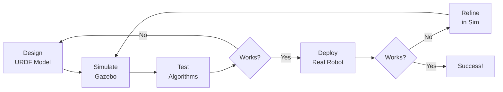
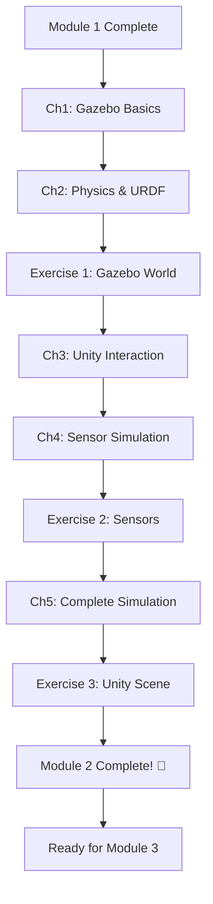

# Module 2: Physics Simulation in Gazebo

## Module Overview

Welcome to Module 2! Now that you've mastered ROS 2 fundamentals, it's time to bring your robots to life in **simulation**. In this module, you'll learn how to simulate humanoid robots with realistic physics, sensors, and environments using **Gazebo** - the industry-standard robotics simulator.

Simulation allows you to:
- **Test safely** - No risk of damaging expensive hardware
- **Iterate quickly** - Change designs instantly without rebuilding
- **Scale up** - Test hundreds of scenarios in parallel
- **Validate before deployment** - Catch bugs before real-world testing

By the end of this module, you'll simulate a complete humanoid robot with sensors, physics, and interactive environments.

## Learning Outcomes

After completing Module 2, you will be able to:

1. **Launch** Gazebo simulations with custom worlds and models
2. **Integrate** URDF models from Module 1 into Gazebo with physics
3. **Configure** physics engines (ODE, Bullet) for realistic motion
4. **Attach** sensors (LiDAR, depth cameras, IMU) to your humanoid
5. **Visualize** sensor data in RViz alongside the Gazebo simulation
6. **Control** simulated robots using the same ROS 2 code from Module 1
7. **Build** complete simulation environments for testing

## Why Simulation?

### The Sim-to-Real Pipeline



Simulation dramatically reduces the **sim-to-real gap** - the difference between simulated and real robot behavior.

### Real-World Examples

**Boston Dynamics** simulates Atlas in custom physics engines before attempting new movements.

**Tesla Optimus** uses simulation to train manipulation skills with millions of synthetic examples.

**Agility Robotics** tests Digit's warehouse navigation in Gazebo before deploying to customer sites.

## Module Structure

This module contains **5 chapters** and **3 hands-on exercises**:

### Chapters

1. **[Gazebo Basics](./ch1-gazebo-basics)** (~16 min)
   - What is Gazebo and how it works
   - Launch files and world configuration
   - GUI overview and camera controls

2. **[Physics & URDF in Gazebo](./ch2-physics-urdf)** (~18 min)
   - Physics engines (ODE, Bullet, Simbody)
   - Integrating URDF models with Gazebo tags
   - Inertial properties and collision geometry

3. **[Unity for HRI Visualization](./ch3-unity-interaction)** (~17 min)
   - When to use Unity vs Gazebo
   - ROS-TCP-Connector for ROS 2 ↔ Unity communication
   - Photorealistic rendering for human-robot interaction studies

4. **[Sensor Simulation](./ch4-sensor-simulation)** (~19 min)
   - LiDAR, depth cameras, RGB cameras, IMU
   - Sensor plugins and SDF configuration
   - Visualizing sensor data in RViz

5. **[Complete Humanoid Simulation](./ch5-complete-simulation)** (~18 min)
   - Combining URDF, sensors, physics, and environment
   - ros2_control for joint control in simulation
   - Building test scenarios

### Hands-On Exercises

**Time Investment**: 4 hours total

1. **[Build a Gazebo World](./exercises/ex1-gazebo-world)** (1 hour) - Intermediate
   - Create environment with obstacles and terrain

2. **[Add Sensors to Humanoid](./exercises/ex2-sensor-setup)** (1 hour) - Intermediate
   - Attach LiDAR and depth camera to your URDF from Module 1

3. **[Unity HRI Scene](./exercises/ex3-unity-scene)** (2 hours) - Open-Ended
   - Create photorealistic Unity scene with ROS 2 integration

Solutions and grading rubrics available in `/solutions/module-2/`

## Prerequisites

Before starting Module 2, ensure you have:

- ✅ Completed Module 1: ROS 2 Foundations
- ✅ Working URDF model of a humanoid robot
- ✅ Gazebo 11 (Classic) installed (see [Prerequisites Guide](../appendix/prerequisites))
- ✅ (Optional) Unity 2022+ with ROS-TCP-Connector for Chapter 3

**Installation Check**:
```bash
gazebo --version
# Should show: Gazebo multi-robot simulator, version 11.x.x
```

## Estimated Time

- **Reading**: 88 minutes (~17-19 min per chapter)
- **Exercises**: 4 hours
- **Code Experimentation**: 3-4 hours
- **Total**: 2-3 weeks for deep understanding (or 1 week fast-paced)

## Learning Path



## Module 2 Success Criteria

You've mastered Module 2 when you can:

- ✅ Launch Gazebo with custom worlds and URDF models
- ✅ Explain the difference between visual, collision, and inertial properties
- ✅ Attach and configure LiDAR and depth cameras
- ✅ Control simulated humanoid joints using ROS 2 topics
- ✅ Visualize sensor data in RViz synchronized with Gazebo
- ✅ Complete all 3 exercises with working solutions

## What's Next?

After completing Module 2, you'll be ready for:

- **Module 3**: NVIDIA Isaac Sim for photorealistic rendering and AI perception
- **Module 4**: Vision-Language-Action models for cognitive planning
- **Capstone Project**: Build a complete autonomous humanoid system

---

**Ready to simulate?** Start with [Chapter 1: Gazebo Basics](./ch1-gazebo-basics) →
