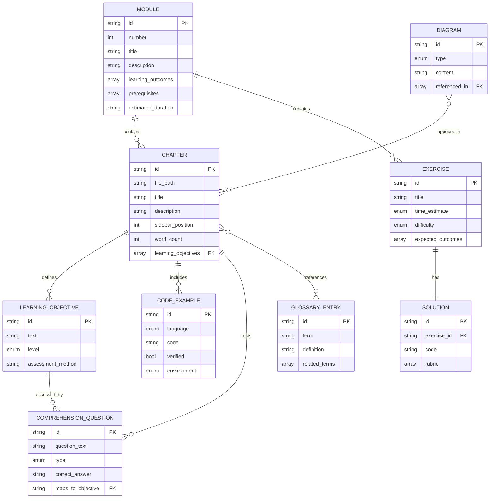

# Data Model: Physical AI Textbook Content Entities

**Purpose**: Define the structure, attributes, and relationships of all content entities in the Physical AI textbook.

**Date**: 2025-12-16

---

## Entity Definitions

### 1. Module

**Description**: A major learning unit representing a cohesive educational theme.

**Attributes**:
- `id` (string): Unique identifier (e.g., "module-1-ros2")
- `number` (integer): Sequential number (1, 2, 3, 4)
- `title` (string): Full title (e.g., "The Robotic Nervous System (ROS 2)")
- `description` (string): 2-3 sentence overview
- `learning_outcomes` (array[string]): High-level outcomes students achieve after completing module
- `prerequisites` (array[string]): Required knowledge before starting (e.g., "Python basics", "Linux terminal")
- `estimated_duration` (string): Expected time to complete (e.g., "2-3 weeks")
- `sidebar_position` (integer): Order in navigation (1-4)
- `collapsed` (boolean): Whether module is collapsed by default in sidebar

**Contains**:
- Multiple `Chapter` entities
- Multiple `Exercise` entities (in exercises/ subdirectory)
- One `index.md` file (module overview)

**Validation Rules**:
- Module `id` must match directory name (`docs/{id}/`)
- Module `number` must be unique (1-4)
- `learning_outcomes` must align with sum of all chapter learning objectives
- `estimated_duration` must match sum of chapter reading times + exercise time estimates

**Example**:
```yaml
id: module-1-ros2
number: 1
title: "Module 1: The Robotic Nervous System (ROS 2)"
description: "Master the fundamentals of robot middleware, communication patterns, and URDF modeling for humanoid robotics."
learning_outcomes:
  - "Create ROS 2 nodes, publishers, and subscribers"
  - "Control humanoid joint movements using rclpy"
  - "Build URDF models for humanoid robots"
prerequisites:
  - "Python 3 basics (variables, functions, classes)"
  - "Linux terminal navigation"
estimated_duration: "2-3 weeks"
sidebar_position: 1
collapsed: false
```

---

### 2. Chapter

**Description**: Self-contained learning unit within a module, following 5-part pedagogical structure.

**Attributes**:
- `id` (string): Unique identifier (e.g., "ch1-middleware")
- `file_path` (string): Absolute path to .md file (e.g., "docs/module-1-ros2/ch1-middleware.md")
- `title` (string): Chapter title (e.g., "ROS 2 Middleware Fundamentals")
- `description` (string): 1-2 sentence summary (max 160 chars for SEO)
- `sidebar_position` (integer): Order within module (1, 2, 3, ...)
- `sidebar_label` (string, optional): Override label in sidebar
- `word_count` (integer): Total words (must be ≤ 3000)
- `reading_time` (integer): Estimated minutes to read (word_count / 200)
- `tags` (array[string]): Searchable keywords (e.g., ["ros2", "middleware", "dds"])
- `prerequisites` (array[string]): Prior chapters or knowledge required
- `learning_objectives` (array[LearningObjective]): Measurable outcomes

**Contains (5 Required Sections)**:
1. **Learning Objectives**: List of `LearningObjective` entities
2. **Conceptual Explanation**: Theory, diagrams, real-world applications
3. **Code Examples**: Multiple `CodeExample` entities
4. **Hands-On Exercises**: References to `Exercise` entities
5. **Comprehension Questions**: Multiple `ComprehensionQuestion` entities

**Validation Rules**:
- `word_count` ≤ 3000 (Constitution Principle I)
- Must include all 5 required sections (Constitution Principle IV)
- All `CodeExample` entities must have `verified: true` before merge
- No `[NEEDS VERIFICATION]` or `[TODO]` markers in final version
- Cross-references must use correct relative paths
- Front-matter must be complete (title, description, sidebar_position)

**Example**:
```yaml
id: ch1-middleware
file_path: docs/module-1-ros2/ch1-middleware.md
title: "ROS 2 Middleware Fundamentals"
description: "Learn how ROS 2 uses DDS middleware for scalable robot communication and why it replaced ROS 1's master-based architecture."
sidebar_position: 1
word_count: 2850
reading_time: 14
tags: ["ros2", "middleware", "dds", "architecture"]
prerequisites: ["Python basics", "Understanding of distributed systems (helpful but not required)"]
learning_objectives:
  - { text: "Define what middleware is and why robotics needs it", level: "comprehension" }
  - { text: "Explain the difference between ROS 1 and ROS 2 architecture", level: "comprehension" }
  - { text: "Identify the components of DDS (Data Distribution Service)", level: "knowledge" }
```

---

### 3. Learning Objective

**Description**: Measurable outcome a student should achieve after completing a chapter, aligned with Bloom's Taxonomy.

**Attributes**:
- `id` (string): Unique identifier (e.g., "LO-M1-C1-01")
- `text` (string): Objective statement (starts with action verb)
- `level` (enum): Bloom's taxonomy level
  - `knowledge`: Remember facts (define, list, identify)
  - `comprehension`: Understand concepts (explain, describe, summarize)
  - `application`: Apply skills (create, implement, configure)
  - `analysis`: Analyze problems (compare, troubleshoot, diagnose)
  - `synthesis`: Create solutions (design, develop, build)
- `assessment_method` (string): How objective is assessed (e.g., "Comprehension Question #3", "Exercise 1")

**Relationships**:
- Belongs to one `Chapter`
- Assessed by one or more `ComprehensionQuestion` entities

**Validation Rules**:
- `text` must start with Bloom's action verb appropriate for `level`
- Every `LearningObjective` must have at least one corresponding `ComprehensionQuestion`
- Objectives must progress from lower (knowledge) to higher (synthesis) levels within a chapter

**Example**:
```yaml
id: LO-M1-C1-01
text: "Explain the difference between ROS 1 and ROS 2 architecture"
level: comprehension
assessment_method: "Comprehension Question #2"
```

---

### 4. Code Example

**Description**: Executable code snippet demonstrating a concept, with explanatory comments for students.

**Attributes**:
- `id` (string): Unique identifier (e.g., "CODE-M1-C2-01")
- `language` (enum): Programming language
  - `python`, `bash`, `yaml`, `xml`, `json`, `cpp`
- `filename` (string, optional): Suggested filename (e.g., "minimal_node.py")
- `line_count` (integer): Number of lines
- `code` (string): Full code content
- `explanation` (string): Paragraph explaining what the code does
- `expected_output` (string, optional): What students should see when running
- `verified` (boolean): Whether code has been tested in target environment
- `environment` (enum): Where code runs
  - `ros2-humble`, `gazebo-11`, `isaac-sim`, `unity`, `local-python`, `bash`
- `references` (array[string]): Links to official API docs

**Validation Rules**:
- `verified` must be `true` before chapter merge (Constitution Principle II)
- Code must include explanatory comments (Constitution: Code Quality)
- Language tag must be specified for syntax highlighting (Constitution Principle III)
- Must execute without errors in specified `environment`

**Example**:
```yaml
id: CODE-M1-C2-01
language: python
filename: "minimal_publisher.py"
line_count: 28
code: |
  import rclpy
  from rclpy.node import Node
  from std_msgs.msg import String
  ...
explanation: "This node creates a publisher that sends 'Hello ROS 2' messages every second. It demonstrates the basic pattern: create node, create publisher, use timer for periodic publishing."
expected_output: "[INFO] [publisher_node]: Published: 'Hello ROS 2 #0'\n[INFO] [publisher_node]: Published: 'Hello ROS 2 #1'"
verified: true
environment: ros2-humble
references:
  - "https://docs.ros.org/en/humble/p/rclpy/rclpy.node.html"
```

---

### 5. Exercise

**Description**: Hands-on learning activity where students apply concepts, with progressive difficulty.

**Attributes**:
- `id` (string): Unique identifier (e.g., "EX-M1-01")
- `file_path` (string): Path to exercise file (e.g., "docs/module-1-ros2/exercises/ex1-first-node.md")
- `title` (string): Exercise title (e.g., "Create Your First ROS 2 Node")
- `time_estimate` (enum): Expected completion time
  - `15min`, `30min`, `1hr`, `2hrs`, `3hrs`
- `difficulty` (enum): Difficulty level
  - `guided`: Step-by-step instructions, minimal problem-solving
  - `intermediate`: High-level requirements, students decide implementation
  - `open-ended`: Problem statement only, multiple valid solutions
- `instructions` (string): What students need to do
- `expected_outcomes` (array[string]): What successful completion looks like
- `hints` (array[string], optional): Clues for common issues
- `prerequisites` (array[string]): Chapters or exercises that must be completed first

**Relationships**:
- Belongs to one `Module`
- Has one `Solution` entity (in `/solutions/`)
- References one or more `Chapter` entities (for concepts applied)

**Validation Rules**:
- `time_estimate` must be one of predefined values (15min, 30min, 1hr, 2hrs, 3hrs)
- Exercise time estimates within a module must sum to realistic total
- Every exercise must have a corresponding solution
- Difficulty must progress: guided → intermediate → open-ended within a module

**Example**:
```yaml
id: EX-M1-01
file_path: docs/module-1-ros2/exercises/ex1-first-node.md
title: "Create Your First ROS 2 Node"
time_estimate: 30min
difficulty: guided
instructions: "Create a ROS 2 node that prints 'Hello from my node!' when launched. Use rclpy and follow the minimal node pattern from Chapter 1."
expected_outcomes:
  - "Node runs without errors"
  - "Message appears in terminal"
  - "Node shuts down cleanly with Ctrl+C"
hints:
  - "Remember to call rclpy.init() before creating the node"
  - "Use self.get_logger().info() for printing messages"
prerequisites:
  - "Chapter 1: ROS 2 Middleware Fundamentals"
```

---

### 6. Solution

**Description**: Reference implementation for an exercise, stored separately from main textbook content.

**Attributes**:
- `id` (string): Unique identifier matching exercise (e.g., "SOL-M1-01")
- `exercise_id` (string): Foreign key to `Exercise.id`
- `file_path` (string): Path to solution file (e.g., "solutions/module-1/ex1-first-node.py")
- `language` (enum): Same as `CodeExample.language`
- `code` (string): Full solution code
- `rubric` (array[RubricItem]): Grading criteria for instructors
- `includes_rubric` (boolean): Whether rubric is included
- `explanation` (string): Why this solution works, alternative approaches

**Relationships**:
- Belongs to one `Exercise` (1:1 relationship)

**Validation Rules**:
- Solution must execute without errors in target environment
- Must be stored in `/solutions/`, NOT under `/docs/` (prevent student exposure)
- Rubric must be provided for graded exercises
- Solution must satisfy all `expected_outcomes` of the exercise

**Example**:
```yaml
id: SOL-M1-01
exercise_id: EX-M1-01
file_path: solutions/module-1/ex1-first-node.py
language: python
code: |
  import rclpy
  from rclpy.node import Node
  ...
rubric:
  - { criterion: "Node initializes correctly", points: 3 }
  - { criterion: "Message is logged", points: 3 }
  - { criterion: "Shutdown is clean", points: 2 }
  - { criterion: "Code follows PEP 8", points: 2 }
includes_rubric: true
explanation: "This solution uses the minimal node pattern. Alternative: could use a timer instead of logging only once."
```

---

### 7. Diagram

**Description**: Visual representation of concepts using Mermaid or ASCII art (no external images).

**Attributes**:
- `id` (string): Unique identifier (e.g., "DIAG-M1-C2-01")
- `type` (enum): Diagram format
  - `mermaid`: Mermaid.js syntax (flowchart, sequence, class, etc.)
  - `ascii`: ASCII art
- `caption` (string): Description of what diagram shows
- `content` (string): Full diagram code/text
- `referenced_in` (array[string]): Chapter IDs where diagram appears

**Validation Rules**:
- No external image files allowed (Constitution Principle I, FR-009)
- Mermaid diagrams must render correctly in Docusaurus
- ASCII art must be monospace-formatted in code blocks

**Example**:
```yaml
id: DIAG-M1-C4-01
type: mermaid
caption: "ROS 2 Publisher-Subscriber Communication Pattern"
content: |
  graph LR
      A[Publisher Node] -->|Topic: /chatter| B[ROS 2 Middleware]
      B -->|Topic: /chatter| C[Subscriber Node]
      B -->|Discovery| D[Service Discovery]
referenced_in: ["ch2-nodes-topics", "ch3-services-actions"]
```

---

### 8. Comprehension Question

**Description**: Assessment item testing student understanding, mapped to learning objectives.

**Attributes**:
- `id` (string): Unique identifier (e.g., "CQ-M1-C1-01")
- `question_text` (string): The question
- `type` (enum): Question format
  - `multiple-choice`: 4 options, 1 correct
  - `short-answer`: Open-ended text response
  - `true-false`: Boolean question
- `options` (array[string], if multiple-choice): Answer choices
- `correct_answer` (string or integer): Answer key (for multiple-choice: index; for short-answer: sample answer)
- `explanation` (string): Why the answer is correct (learning moment)
- `maps_to_objective` (string): Foreign key to `LearningObjective.id`

**Relationships**:
- Belongs to one `Chapter`
- Assesses one `LearningObjective`

**Validation Rules**:
- Every `LearningObjective` must have at least one corresponding `ComprehensionQuestion`
- Multiple-choice must have exactly 4 options with 1 correct answer
- Explanation must be provided for all question types

**Example**:
```yaml
id: CQ-M1-C1-02
question_text: "Which QoS policy ensures message delivery even if the subscriber joins after the publisher?"
type: multiple-choice
options:
  - "BEST_EFFORT with VOLATILE"
  - "RELIABLE with TRANSIENT_LOCAL"
  - "BEST_EFFORT with TRANSIENT_LOCAL"
  - "RELIABLE with VOLATILE"
correct_answer: 1  # Index of "RELIABLE with TRANSIENT_LOCAL"
explanation: "RELIABLE guarantees delivery, and TRANSIENT_LOCAL persists messages so late-joining subscribers can receive them."
maps_to_objective: LO-M1-C1-03
```

---

### 9. Glossary Entry

**Description**: Definition of a robotics term, maintaining consistent terminology across the textbook.

**Attributes**:
- `id` (string): Unique identifier (e.g., "GLOSS-ROS2")
- `term` (string): The term (e.g., "ROS 2", "URDF", "VSLAM")
- `definition` (string): Clear, beginner-friendly definition
- `related_terms` (array[string]): Other glossary terms referenced
- `first_introduced` (string): Chapter ID where term first appears
- `category` (enum): Term category
  - `ros2`, `simulation`, `isaac`, `vla`, `general-robotics`

**Relationships**:
- Referenced by multiple `Chapter` entities (many-to-many)

**Validation Rules**:
- Terminology must follow Constitution standards:
  - "Humanoid robot" not "humanoid" alone
  - "ROS 2" not "ROS2" or "ROS"
  - "Isaac Sim" for simulation, "Isaac ROS" for accelerated nodes
  - "Vision-Language-Action (VLA)" on first use, then "VLA"
- All glossary entries maintained in `/docs/glossary.md`

**Example**:
```yaml
id: GLOSS-URDF
term: "URDF"
definition: "Unified Robot Description Format - an XML format for describing a robot's physical structure, including links (rigid bodies), joints (connections), sensors, and visual/collision geometry. Used in ROS 2 for robot modeling and simulation."
related_terms: ["SDF", "Link", "Joint", "Gazebo"]
first_introduced: ch5-urdf-modeling
category: ros2
```

---

## Entity Relationships

### Hierarchical Structure

```
Textbook
├── Module (1-4)
│   ├── index.md (module overview)
│   ├── Chapter (5-7 per module)
│   │   ├── Learning Objectives (3-5 per chapter)
│   │   ├── Code Examples (5-10 per chapter)
│   │   ├── Comprehension Questions (5-8 per chapter)
│   │   └── References to Exercises
│   └── Exercises (3-4 per module)
│       └── Solution (1 per exercise)
├── Capstone Project (1)
│   └── Multiple chapters (overview, architecture, implementation, evaluation)
├── Appendix (3 chapters)
└── Glossary (100-150 entries)
```

### Relationship Diagram



---

## Validation Rules Summary

### Pre-Commit Checks

1. **Chapter Word Count**: Automated script validates `word_count` ≤ 3000
2. **Code Verification**: All `CodeExample` entities must have `verified: true`
3. **Link Validation**: All cross-references use correct relative paths, no broken links
4. **Front-Matter Completeness**: All required fields present (title, description, sidebar_position)
5. **Learning Objective Coverage**: Every objective has ≥ 1 comprehension question
6. **Exercise Time Consistency**: Exercise estimates sum to reasonable module duration
7. **No Placeholders**: Zero `[NEEDS VERIFICATION]`, `[TODO]`, or `{{PLACEHOLDER}}` markers

### Quality Gate Checks (Constitution)

- [ ] All code examples execute without errors in target environment (ROS 2 Humble + Gazebo 11 or Isaac Sim)
- [ ] Learning objectives map to comprehension questions
- [ ] No `[NEEDS VERIFICATION]` or `[TODO]` markers remain
- [ ] Front-matter complete (title, description, sidebar_position, tags)
- [ ] Cross-references use correct relative paths
- [ ] Spell check passed (technical terms added to dictionary)

---

## Content Metrics

**Estimated Textbook Size**:
- Modules: 4
- Chapters: ~25 (avg 6 per module)
- Exercises: ~35 (avg 8-9 per module)
- Code Examples: ~100 (avg 4 per chapter)
- Diagrams: ~40 (avg 1-2 per chapter)
- Comprehension Questions: ~175 (avg 7 per chapter)
- Glossary Entries: ~120
- Total Word Count: ~60,000-70,000 words (avg 2,500 per chapter × 25 chapters)

**Time Investment (Students)**:
- Module 1: 2-3 weeks (10-15 hours reading + 6-8 hours exercises)
- Module 2: 2-3 weeks (10-15 hours reading + 6-8 hours exercises)
- Module 3: 2-3 weeks (10-15 hours reading + 8-10 hours exercises)
- Module 4: 2-3 weeks (10-15 hours reading + 8-10 hours exercises)
- Capstone Project: 1 week (15-20 hours)
- **Total**: 10-14 weeks (80-100 hours)

**Aligns with Specification SC-009**: "Instructors can map the textbook to a 10-14 week university course"
