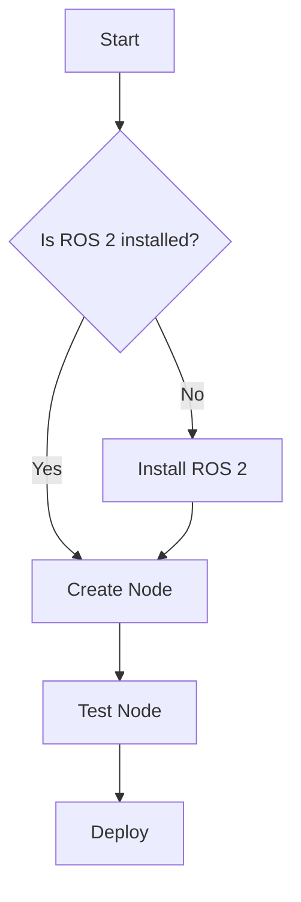

# Contributor Quickstart Guide: Physical AI Textbook

**Purpose**: Step-by-step guide for educators and contributors to set up the development environment and start creating textbook content.

**Date**: 2025-12-16

---

## Prerequisites

Before you begin, ensure you have the following installed:

### Required Software

1. **Node.js 18+ and npm**
   ```bash
   # Check versions
   node --version  # Should be v18.0.0 or higher
   npm --version   # Should be 9.0.0 or higher

   # Install Node.js from https://nodejs.org/
   # Or use nvm (Node Version Manager):
   curl -o- https://raw.githubusercontent.com/nvm-sh/nvm/v0.39.0/install.sh | bash
   nvm install 18
   nvm use 18
   ```

2. **Git**
   ```bash
   # Check version
   git --version

   # Install on Ubuntu/Debian
   sudo apt update && sudo apt install git

   # Configure Git
   git config --global user.name "Your Name"
   git config --global user.email "your.email@example.com"
   ```

3. **Code Editor**
   - Recommended: Visual Studio Code with extensions:
     - Markdown All in One
     - Mermaid Markdown Syntax Highlighting
     - Python (for code examples)
     - YAML

### Optional (for testing code examples)

4. **ROS 2 Humble** (for Module 1-4 code verification)
   ```bash
   # Ubuntu 22.04
   sudo apt install software-properties-common
   sudo add-apt-repository universe
   sudo apt update && sudo apt install curl
   sudo curl -sSL https://raw.githubusercontent.com/ros/rosdistro/master/ros.key -o /usr/share/keyrings/ros-archive-keyring.gpg
   echo "deb [arch=$(dpkg --print-architecture) signed-by=/usr/share/keyrings/ros-archive-keyring.gpg] http://packages.ros.org/ros2/ubuntu $(. /etc/os-release && echo $UBUNTU_CODENAME) main" | sudo tee /etc/apt/sources.list.d/ros2.list > /dev/null
   sudo apt update
   sudo apt install ros-humble-desktop
   ```

5. **Gazebo 11** (for Module 2 simulation examples)
   ```bash
   sudo apt install gazebo11 ros-humble-gazebo-ros-pkgs
   ```

6. **Isaac Sim 2023.1+** (for Module 3 examples)
   - Download from NVIDIA Omniverse: https://developer.nvidia.com/isaac-sim
   - Requires NVIDIA RTX GPU

---

## 1. Repository Setup

### Clone the Repository

```bash
# Clone the textbook repository
git clone https://github.com/your-org/physical-ai-textbook.git
cd physical-ai-textbook

# Create a new branch for your work
git checkout -b chapter-1-1-middleware  # Example: chapter-<module>-<chapter>-<slug>
```

### Install Dependencies

```bash
# Install Docusaurus and all dependencies
npm install

# This installs:
# - Docusaurus 3.x
# - React 18+
# - Prism (syntax highlighting)
# - Mermaid (diagrams)
# - All required plugins
```

### Verify Installation

```bash
# Start the development server
npm start

# This should:
# - Build the site
# - Open http://localhost:3000 in your browser
# - Enable hot-reloading (changes appear instantly)

# Press Ctrl+C to stop the server
```

If you see the textbook homepage, you're ready to contribute!

---

## 2. Project Structure

Understanding the repository layout:

```
physical-ai-textbook/
├── docs/                         # All textbook content (Markdown files)
│   ├── intro.md                  # Homepage
│   ├── glossary.md               # Terminology reference
│   ├── module-1-ros2/            # Module 1 content
│   │   ├── index.md              # Module overview
│   │   ├── ch1-middleware.md     # Chapter 1
│   │   ├── ch2-nodes-topics.md   # Chapter 2
│   │   └── exercises/            # Hands-on exercises
│   │       ├── ex1-first-node.md
│   │       └── ex2-publisher-subscriber.md
│   ├── module-2-simulation/
│   ├── module-3-isaac/
│   ├── module-4-vla/
│   ├── capstone/
│   └── appendix/
├── solutions/                    # Exercise solutions (NOT in docs/)
│   ├── module-1/
│   │   ├── ex1-first-node.py
│   │   └── ex2-publisher-subscriber.py
│   ├── module-2/
│   └── ...
├── static/                       # Static assets (minimal use)
│   └── img/
├── docusaurus.config.js          # Docusaurus configuration
├── sidebars.js                   # Sidebar navigation
├── package.json                  # Node dependencies
├── README.md                     # Contributor guide
└── .github/
    └── workflows/
        └── deploy.yml            # GitHub Pages deployment
```

**Key Principles**:
- **One chapter = one file** (e.g., `ch1-middleware.md`)
- **Exercises stored separately** in `exercises/` subdirectory
- **Solutions stored outside `/docs/`** to prevent student access
- **No external images** - use Mermaid or ASCII art

---

## 3. Creating a New Chapter

### Step 1: Choose the Right Location

Chapters belong to modules. If creating Module 1, Chapter 4:

```bash
# File path: docs/module-1-ros2/ch4-rclpy-control.md
```

### Step 2: Create the Chapter File

```bash
# From repository root
touch docs/module-1-ros2/ch4-rclpy-control.md
```

### Step 3: Add Front-Matter

Every chapter **MUST** start with front-matter (metadata):

```markdown
---
title: Python Control for Humanoid Joints
description: Learn how to use rclpy to control humanoid robot joints with position and velocity commands.
sidebar_position: 4
tags: [ros2, python, rclpy, control, humanoid]
---
```

**Required Fields**:
- `title`: Chapter title (shown in content and sidebar)
- `description`: 1-2 sentence summary (max 160 chars, used for SEO)
- `sidebar_position`: Order in sidebar (1, 2, 3, ...)

**Optional Fields**:
- `tags`: Searchable keywords
- `sidebar_label`: Override sidebar name (if different from title)

### Step 4: Follow the 5-Part Structure

Every chapter **MUST** include these 5 sections:

#### 1. Learning Objectives

Start with measurable learning objectives using Bloom's taxonomy action verbs:

```markdown
## Learning Objectives

By the end of this chapter, you will be able to:

1. **Explain** the difference between position and velocity control for robot joints
2. **Create** an rclpy node that publishes joint commands
3. **Implement** a PID controller for smooth joint movements
4. **Troubleshoot** common joint control issues in simulation
```

#### 2. Conceptual Explanation

Teach the theory with clear explanations, real-world examples, and diagrams:

```markdown
## What is Joint Control?

Robot joints are the connection points between rigid bodies (links) that allow movement.
For humanoid robots, we have:

- **Revolute joints**: Rotate like human elbows, knees, hips (most common)
- **Prismatic joints**: Slide linearly like telescoping antennas (rare in humanoids)

### Position Control vs Velocity Control

**Position Control**: Tell the joint to move to a specific angle (e.g., "move elbow to 90 degrees")
- Use case: Precise positioning for grasping objects
- Pro: Accurate endpoint
- Con: Jerky motion if not smoothed

**Velocity Control**: Tell the joint how fast to rotate (e.g., "rotate elbow at 0.5 rad/s")
- Use case: Smooth walking motions
- Pro: Natural-looking movement
- Con: Need to calculate when to stop

### The Control Loop

\`\`\`mermaid
graph LR
    A[Desired Joint Angle] --> B[Controller]
    B --> C[Motor Command]
    C --> D[Physical Joint]
    D --> E[Actual Joint Angle]
    E --> B
\`\`\`

This feedback loop ensures the joint reaches and maintains the target position.
```

#### 3. Code Examples

Provide **verified** code with explanatory comments:

````markdown
## Example: Controlling a Humanoid Arm Joint

Let's create a node that moves a humanoid's shoulder joint.

```python title="shoulder_control.py" showLineNumbers
import rclpy
from rclpy.node import Node
from std_msgs.msg import Float64

class ShoulderController(Node):
    """
    Controls the shoulder joint of a humanoid robot.

    This node publishes position commands to move the shoulder
    between 0 and 90 degrees (0 to 1.57 radians).
    """
    def __init__(self):
        super().__init__('shoulder_controller')

        # Create a publisher for the shoulder joint
        # Topic name follows pattern: /robot_name/joint_name/command
        self.publisher_ = self.create_publisher(
            Float64,
            '/humanoid/shoulder_joint/command',
            10  # Queue size
        )

        # Create a timer that calls move_shoulder every 2 seconds
        self.timer = self.create_timer(2.0, self.move_shoulder)

        # Track current position (start at 0 radians = 0 degrees)
        self.position = 0.0
        self.direction = 1  # 1 = move up, -1 = move down

    def move_shoulder(self):
        """Move the shoulder joint back and forth."""
        # Publish current position
        msg = Float64()
        msg.data = self.position
        self.publisher_.publish(msg)

        self.get_logger().info(f'Shoulder position: {self.position:.2f} rad '
                               f'({self.position * 57.3:.1f} deg)')

        # Update position for next time (0.2 radians = ~11 degrees per step)
        self.position += 0.2 * self.direction

        # Reverse direction at limits (0 to 1.57 radians)
        if self.position >= 1.57:
            self.direction = -1
        elif self.position <= 0.0:
            self.direction = 1

def main(args=None):
    rclpy.init(args=args)
    controller = ShoulderController()
    rclpy.spin(controller)
    rclpy.shutdown()

if __name__ == '__main__':
    main()
```

**Expected Output:**
```
[INFO] [shoulder_controller]: Shoulder position: 0.00 rad (0.0 deg)
[INFO] [shoulder_controller]: Shoulder position: 0.20 rad (11.5 deg)
[INFO] [shoulder_controller]: Shoulder position: 0.40 rad (22.9 deg)
...
```

**Verification**: This code has been tested in ROS 2 Humble with a simulated humanoid in Gazebo.
````

#### 4. Hands-On Exercises

Reference exercises in the `exercises/` subdirectory:

```markdown
## Exercises

Ready to practice? Complete these exercises to reinforce your understanding:

1. **[Exercise 1: Control a Single Joint](./exercises/ex1-single-joint.md)** (30 minutes)
   - Create a node that moves a humanoid knee joint
   - Add smooth motion using velocity control

2. **[Exercise 2: Coordinated Arm Movement](./exercises/ex2-coordinated-arm.md)** (1 hour)
   - Control shoulder and elbow joints simultaneously
   - Implement reaching motion to a target position

3. **[Exercise 3: Walking Gait Pattern](./exercises/ex3-walking-gait.md)** (2 hours) ⭐ Challenge
   - Generate a simple walking pattern for leg joints
   - Sync left and right legs for stable locomotion
```

#### 5. Comprehension Questions

Test understanding with questions mapped to learning objectives:

```markdown
## Comprehension Questions

Test your understanding:

**Question 1**: What is the main advantage of velocity control over position control for humanoid walking motions?

<details>
<summary>Click to reveal answer</summary>

**Answer**: Velocity control produces smoother, more natural-looking motion because it gradually accelerates and decelerates joints. Position control can cause jerky movements if the joint tries to reach the target position instantly.

</details>

---

**Question 2**: In the code example above, why do we reverse the direction at 1.57 radians?

A) Because 1.57 radians is the maximum safe angle for human shoulders
B) Because 1.57 radians ≈ 90 degrees, the joint's physical limit in the URDF
C) Because ROS 2 limits joint commands to ±π/2 radians
D) Because the motor cannot exceed this speed

<details>
<summary>Click to reveal answer</summary>

**Answer**: **B** - The URDF file defining the humanoid robot specifies the shoulder joint's upper limit as 1.57 radians (90 degrees). Sending commands beyond this range would be ignored or cause warnings.

</details>
```

### Step 5: Validate Your Chapter

Before committing, check:

- [ ] Front-matter complete (title, description, sidebar_position)
- [ ] All 5 sections present (objectives, explanation, code, exercises, questions)
- [ ] Word count ≤ 3000 words (use `wc -w ch4-rclpy-control.md`)
- [ ] Code examples have language tags and comments
- [ ] No `[TODO]` or `[NEEDS VERIFICATION]` markers
- [ ] Cross-references use correct paths (e.g., `./exercises/ex1-single-joint.md`)
- [ ] Code tested and verified in target environment

---

## 4. Adding Code Examples

### Language Tags

Always specify the programming language for syntax highlighting:

````markdown
```python
# Python code
```

```bash
# Bash commands
```

```yaml
# YAML configuration
```

```xml
<!-- XML for URDF/SDF -->
```
````

### Code Block Features

**Show line numbers**:
````markdown
```python showLineNumbers
import rclpy
```
````

**Add filename**:
````markdown
```python title="my_node.py"
import rclpy
```
````

**Highlight specific lines**:
````markdown
```python {3-5}
import rclpy
from rclpy.node import Node
# These lines (3-5) will be highlighted
class MyNode(Node):
    pass
```
````

### Commenting Standards

**Good Example** (explains WHY, not just WHAT):
```python
# Create a publisher for joint commands
# The queue size of 10 buffers messages if the subscriber is slow
self.publisher_ = self.create_publisher(Float64, '/joint/command', 10)
```

**Bad Example** (just repeats code):
```python
# Create a publisher
self.publisher_ = self.create_publisher(Float64, '/joint/command', 10)
```

---

## 5. Creating Exercises and Solutions

### Exercise File Structure

Exercises go in `docs/module-X/exercises/`:

```markdown
---
title: "Exercise 1: Control a Single Joint"
description: Practice controlling a humanoid knee joint with position commands
sidebar_position: 1
---

# Exercise 1: Control a Single Joint

**Time Estimate**: 30 minutes
**Difficulty**: Guided

## Objective

Create a ROS 2 node that moves a humanoid's knee joint between 0 and 120 degrees.

## Prerequisites

- Completed Chapter 4: Python Control for Humanoid Joints
- ROS 2 Humble installed
- Gazebo humanoid simulation running

## Instructions

1. Create a new Python file `knee_control.py`
2. Import rclpy and necessary message types
3. Create a node that publishes to `/humanoid/knee_joint/command`
4. Use a timer to move the joint smoothly every 0.1 seconds
5. Test your node in simulation

## Expected Outcome

Your node should:
- Start with knee at 0 degrees (straight leg)
- Gradually bend to 120 degrees
- Return to 0 degrees
- Loop continuously

## Hints

<details>
<summary>Stuck? Click for a hint</summary>

Remember to convert degrees to radians: `radians = degrees * (3.14159 / 180)`

</details>

<details>
<summary>Another hint</summary>

Use a state variable to track current position and update it incrementally:
```python
self.position += 0.05  # Small increment for smooth motion
```

</details>

## Grading Rubric

- **3 points**: Node runs without errors
- **3 points**: Joint moves smoothly (no jerky motion)
- **2 points**: Full range achieved (0 to 120 degrees)
- **2 points**: Code follows PEP 8 style guidelines

**Total**: 10 points
```

### Solution File Structure

Solutions go in `solutions/module-X/`:

```python
# solutions/module-1/ex1-single-joint.py

"""
Solution: Exercise 1 - Control a Single Joint

This solution demonstrates smooth knee joint control with position commands.

Author: Physical AI Textbook Team
Verified: ROS 2 Humble + Gazebo 11
"""

import rclpy
from rclpy.node import Node
from std_msgs.msg import Float64

class KneeController(Node):
    def __init__(self):
        super().__init__('knee_controller')

        self.publisher_ = self.create_publisher(
            Float64,
            '/humanoid/knee_joint/command',
            10
        )

        # Update every 0.1 seconds for smooth motion
        self.timer = self.create_timer(0.1, self.move_knee)

        self.position = 0.0  # Start at 0 radians
        self.target = 2.094  # 120 degrees in radians
        self.direction = 1   # 1 = bend, -1 = straighten
        self.step = 0.05     # Small steps for smoothness

    def move_knee(self):
        msg = Float64()
        msg.data = self.position
        self.publisher_.publish(msg)

        self.get_logger().info(
            f'Knee: {self.position:.2f} rad ({self.position * 57.3:.1f}°)'
        )

        # Update position
        self.position += self.step * self.direction

        # Reverse at limits
        if self.position >= self.target:
            self.direction = -1
        elif self.position <= 0.0:
            self.direction = 1

def main(args=None):
    rclpy.init(args=args)
    node = KneeController()
    rclpy.spin(node)
    rclpy.shutdown()

if __name__ == '__main__':
    main()

# Alternative Approaches:
# 1. Use trajectory_msgs for more advanced control
# 2. Implement PID controller for better tracking
# 3. Add acceleration/deceleration profiles
```

---

## 6. Creating Diagrams

### Mermaid Diagrams

Use Mermaid for flowcharts, sequence diagrams, and more:

````markdown

````

**Supported Diagram Types**:
- `graph` / `flowchart`: Flowcharts
- `sequenceDiagram`: Sequence diagrams
- `classDiagram`: UML class diagrams
- `stateDiagram`: State machines
- `erDiagram`: Entity-relationship diagrams

**Mermaid Documentation**: https://mermaid.js.org/

### ASCII Art

For simple diagrams:

```markdown
```
ROS 2 Node Architecture

    ┌────────────────┐
    │   ROS 2 Node   │
    └────────┬───────┘
             │
       ┌─────┴─────┐
       │           │
  ┌────▼────┐ ┌───▼────┐
  │Publisher│ │Subscriber│
  └────┬────┘ └───┬────┘
       │          │
       ▼          ▼
    Topic      Topic
```
```

---

## 7. Testing Code Examples

### Manual Testing

**ROS 2 Examples**:
```bash
# Source ROS 2
source /opt/ros/humble/setup.bash

# Create a test workspace
mkdir -p ~/ros2_ws/src
cd ~/ros2_ws/src

# Copy your code
cp ~/physical-ai-textbook/docs/module-1-ros2/examples/shoulder_control.py .

# Make executable
chmod +x shoulder_control.py

# Run
python3 shoulder_control.py
```

**Gazebo Simulation**:
```bash
# Launch humanoid in Gazebo
ros2 launch humanoid_description gazebo.launch.py

# In another terminal, run your controller
python3 shoulder_control.py

# Watch joint move in Gazebo
```

### Verification Checklist

Before marking code as verified:
- [ ] Code executes without errors
- [ ] Expected output matches documentation
- [ ] Code follows PEP 8 (for Python)
- [ ] All imports are standard or ROS 2 packages
- [ ] Comments explain non-obvious logic
- [ ] Verified in target environment (ROS 2 Humble)

---

## 8. Quality Checks

### Pre-Commit Checklist

Before committing your chapter:

```bash
# 1. Check word count (should be ≤ 3000)
wc -w docs/module-1-ros2/ch4-rclpy-control.md

# 2. Build the site locally
npm run build

# 3. Check for broken links (if link checker installed)
npm run check-links

# 4. Preview your changes
npm start
# Navigate to your chapter in the browser

# 5. Run linter (if configured)
npm run lint
```

### Constitution Compliance

Your chapter must satisfy:
- **Principle I (Content Modularity)**: ≤ 3000 words, self-contained
- **Principle II (Technical Accuracy)**: All APIs verified, no invented code
- **Principle III (Docusaurus Standards)**: Proper front-matter, Mermaid diagrams
- **Principle IV (Pedagogical Structure)**: All 5 sections present
- **Principle V (Version Control Ready)**: One file, atomic commits
- **Principle VI (Physical AI Focus)**: Humanoid robotics examples

---

## 9. Committing Changes

### Atomic Commits

Each commit should represent one complete pedagogical unit:

```bash
# Good: Complete chapter
git add docs/module-1-ros2/ch4-rclpy-control.md
git commit -m "docs(module-1): add Chapter 4 on rclpy joint control

- Add learning objectives for position/velocity control
- Include shoulder controller code example
- Create 3 hands-on exercises with solutions
- Add 5 comprehension questions with answers

Verified: All code tested in ROS 2 Humble + Gazebo 11"

# Good: Fix typo
git add docs/module-1-ros2/ch3-services-actions.md
git commit -m "fix(module-1): correct service callback parameter name in Ch3"

# Bad: Multiple unrelated changes
git add docs/module-1-ros2/ch2-nodes-topics.md docs/module-3-isaac/ch1-intro-isaac.md
git commit -m "updates"
```

### Branch Naming

Use descriptive branch names:

```bash
# Pattern: chapter-<module>-<chapter>-<slug>
git checkout -b chapter-1-4-rclpy-control

# For exercises
git checkout -b exercise-2-3-unity-scene

# For fixes
git checkout -b fix-module-1-code-example
```

### Push and Create Pull Request

```bash
# Push your branch
git push origin chapter-1-4-rclpy-control

# Create Pull Request on GitHub
# Title: "Add Module 1, Chapter 4: Python Control for Humanoid Joints"
# Description: Summary of changes, checklist of quality gates passed
```

---

## 10. Deploying to GitHub Pages

### Automated Deployment

The textbook uses GitHub Actions for automatic deployment:

1. **Push to `main` branch** triggers deployment workflow
2. **Build process** runs `npm run build`
3. **Deploy** publishes to GitHub Pages

**Workflow file**: `.github/workflows/deploy.yml`

### Manual Deployment

If you need to deploy manually:

```bash
# Build the site
npm run build

# Deploy to gh-pages branch
npm run deploy

# Or using gh-pages package directly
npx gh-pages -d build
```

### Verify Deployment

After deployment completes:
1. Visit `https://your-username.github.io/physical-ai-textbook/`
2. Navigate to your new chapter
3. Verify all content renders correctly
4. Test code examples load properly
5. Check diagrams display

---

## 11. Getting Help

### Resources

- **Docusaurus Documentation**: https://docusaurus.io/docs
- **Mermaid Documentation**: https://mermaid.js.org/
- **ROS 2 Humble Documentation**: https://docs.ros.org/en/humble/
- **Markdown Guide**: https://www.markdownguide.org/

### Common Issues

**Issue**: "Module not found" error when running `npm start`
**Solution**: Delete `node_modules/` and run `npm install` again

**Issue**: Code example not syntax highlighting
**Solution**: Add language tag after opening backticks (e.g., ` ```python `)

**Issue**: Mermaid diagram not rendering
**Solution**: Ensure `@docusaurus/theme-mermaid` is installed and configured in `docusaurus.config.js`

**Issue**: Chapter not appearing in sidebar
**Solution**: Check `sidebar_position` in front-matter and verify file is in correct directory

### Contact

- **GitHub Discussions**: https://github.com/your-org/physical-ai-textbook/discussions
- **Issues**: https://github.com/your-org/physical-ai-textbook/issues

---

## Summary

You're ready to contribute! Key takeaways:

1. **Setup**: Node.js 18+, Git, code editor
2. **Structure**: One chapter = one .md file in `docs/module-X/`
3. **Format**: Front-matter + 5-part pedagogical structure
4. **Code**: Verified examples with language tags and comments
5. **Quality**: ≤ 3000 words, all sections present, no placeholders
6. **Commit**: Atomic commits with descriptive messages
7. **Deploy**: Automatic via GitHub Actions on push to main

**Next Steps**: Choose a chapter to write and follow this guide. Happy contributing!
